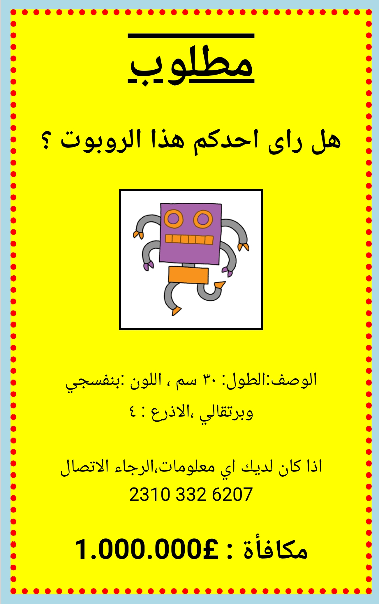

## المقدمة

في هذا المشروع ، سوف تتعلم كيف تصنع الملصق الخاص بك.

### معلومات إضافية لقادة النادي

إذا كنت بحاجة إلى طباعة هذا المشروع، فيُرجى استخدام [Printer friendly version](https://projects.raspberrypi.org/en/projects/wanted/print).

## \--- collapse \---

## title: ملاحظات قادة النادي

## مقدمة:

في هذا المشروع ، ستتاح الفرصة للأطفال لكتابة CSS الخاص بهم. سيقومون أيضًا بتعديل وكتابة خصائص ومحددات CSS لإنشاء ملصق خاص بهم.

## الموارد المتوفرة على الإنترنت

لكتابة ملفات HTML & CSS نوصي بإستخدام [trinket](https://trinket.io/). يحتوي هذا المشروع على ملفات trinket التالية:

* ["مطلوب" نقطة البداية -- jumpto.cc/web-wanted](http://jumpto.cc/web-wanted)

يمكن أن يستخدم الأطفال أيضًا ملف trinket الفارغ هذا [(jumpto.cc/html-blank)](http://jumpto.cc/html-blank) لكتابة ملفات HTML الخاصة بهم و & CSS، أو يمكنهم استخدام قالب trinket هذا [(jumpto.cc/html-template)](http://jumpto.cc/html-template).

كما يوجد مشروع trinket يحتوي على نموذج حلول للتحديات:

* ["مطلوب" انتهى - trinket.io/html/ebeb56398a](https://trinket.io/html/ebeb56398a)

## الموارد المتوفرة دون اتصال بالإنترنت

هذا المشروع يمكن [إكماله دون اتصال بالإنترنت](https://www.codeclubprojects.org/en-GB/resources/webdev-working-offline/) إذا كنت تفضل ذلك. يمكنك الوصول إلى مصادر المشروع من خلال النقر فوق رابط "مواد المشروع" الخاص بهذا المشروع. يحتوي هذا الرابط على قسم "مصادر المشروع"، الذي يتضمن الموارد التي يحتاج إليها الأطفال لإكمال هذا المشروع من دون اتصال بالإنترنت. تأكد من أن كل طفل لديه امكانية الوصول إلى نسخة من هذه المصادر. يتضمن هذا القسم الملفات التالية:

* template/index.html
* template/style.css
* wanted/index.html
* wanted/style.css
* wanted/robot.png

يمكنك أيضاً العثور على نسخة كاملة من تحديات هذا المشروع في قسم "موارد المتطوعين" الذي يحتوي على:

* wanted-finished/index.html
* wanted-finished/style.css
* wanted-finished/robot.png

(جميع الموارد المذكورة أعلاه قابلة للتنزيل أيضًا كملفات `.zip` للمشاريع والمتطوعين)

## أهداف التعلم

* يتيح هذا المشروع للأطفال الفرصة لكتابة CSS الخاص بهم لتصميم صفحة ويب.

يتناول هذا المشروع عناصر من الصفوف التالية من المناهج الرقمية الخاصة بـ [Raspberry Pi](http://rpf.io/curriculum):

* [التصاميم الأساسية لنماذج ثنائية وثلاثية الأبعاد.](https://www.raspberrypi.org/curriculum/design/creator).

## التحديات

* "تحسين الملصق الخاص بك" - إضافة خصائص CSS جديدة إلى ` div ` المحدد;
* "تحسين الصورة الخاصة بك" - إضافة خصائص CSS جديدة إلى `img` المحدد;
* "اجعل الملصق رائعًا" - إضافة خصائص CSS جديدة و `h3` و`p` محددات;
* "الإعلان عن حدث" - كتابة وتحرير كود HTML و CSS.

\--- /collapse \---

## \--- collapse \---

## title: مواد المشروع

## موارد المشروع

* [ملف.zip يحتوي على جميع مصادر المشروع](resources/wanted-project-resources.zip)
* [ملف Trinket عبر الإنترنت يحتوي على كل موارد المشروع 'المطلوبة!'](http://jumpto.cc/web-wanted)
* [قالب Trinket عبر الإنترنت](http://jumpto.cc/trinket-template)
* [Trinket فارغ عبر الإنترنت](http://jumpto.cc/trinket-blank)
* [template/index.html](resources/template-index.html)
* [template/style.css](resources/template-style.css)
* [wanted/index.html](resources/wanted-index.html)
* [wanted/style.css](resources/wanted-style.css)
* [wanted/robot.png](resources/wanted-robot.png)

## موارد قادة النادي

* [ملف.zip يحتوي على جميع مصادر المشروع المكتملة](resources/wanted-volunteer-resources.zip)
* [مشروع Trinket المكتمل على الإنترنت](https://trinket.io/html/ebeb56398a)
* [wanted-finished/index.html](resources/wanted-finished-index.html)
* [wanted-finished/style.css](resources/wanted-finished-style.css)
* [wanted-finished/robot.png](resources/twanted-finished-robot.png)

\--- /collapse \---