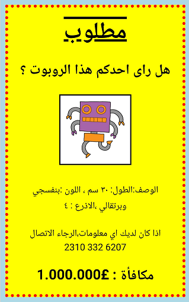

## المقدمة

في هذا المشروع، ستتعلم كيف تصنع ملصقًا من ابتكارك!

### معلومات إضافية لقادة النادي

إذا كنت بحاجة إلى طباعة هذا المشروع، فيُرجى استخدام [نسخة سهلة الطباعة](https://projects.raspberrypi.org/ar-SA/projects/wanted/print).

--- collapse ---
---
title: ملاحظات قادة النادي
---

## المقدمة:
في هذا المشروع، سيحظى الأطفال بفرصة لكتابة تعليمات CSS البرمجية التي يريدونها. كما سيكتبون خصائص CSS ومحدداتها ويحرِّرونها لصناعة ملصقات من ابتكارهم.

## الموارد المتوفرة على الإنترنت

نوصي باستخدام [trinket](https://trinket.io/) لكتابة ملفات HTML وCSS على الإنترنت. يحتوي هذا المشروع على ملفات trinket التالية:

+ ['مطلوب' مشروع البدء -- jumpto.cc/web-wanted](http://jumpto.cc/web-wanted)

يمكن أن يستخدم الأطفال أيضًا ملف trinket الفارغ هذا [(jumpto.cc/html-blank)](http://jumpto.cc/html-blank) لكتابة ملفات HTML و CSS، أو يمكنهم استخدام قالب trinket هذا [(jumpto.cc/html-template)](http://jumpto.cc/html-template).

كما يوجد مشروع trinket يحتوي على نموذج حل للتحديات:

+ [مشروع 'مطلوب' مُكتمل -- trinket.io/html/ebeb56398a](https://trinket.io/html/ebeb56398a)

## الموارد المتوفرة دون اتصال بالإنترنت
بالنسبة إلى هذا المشروع، يمكن [إكماله دون اتصال بالإنترنت](https://www.codeclubprojects.org/en-GB/resources/webdev-working-offline/) إذا كنت تفضل ذلك. يمكنك الوصول إلى موارد المشروع من خلال النقر فوق رابط "مواد المشروع" الخاص بهذا المشروع. يحتوي هذا الرابط على قسم "موارد المشروع"، الذي يتضمن الموارد التي يحتاج إليها الأطفال لإكمال هذا المشروع دون اتصال بالإنترنت. تأكد من أن كل طفل لديه حق الوصول إلى نسخة من هذه الموارد. يتضمن هذا القسم الملفات التالية:

+ template/index.html
+ template/style.css
+ wanted/index.html
+ wanted/style.css
+ wanted/robot.png

يمكنك أيضًا العثور على نسخة كاملة من تحديات هذا المشروع في قسم "موارد المتطوعين" الذي يحتوي على:

+ wanted-finished/index.html
+ wanted-finished/style.css
+ wanted-finished/robot.png

(جميع الموارد المذكورة أعلاه قابلة للتنزيل أيضًا كملفات `.zip` للمشاريع والمتطوعين).

## أهداف التعلم
+ يمنح هذا المشروع فرصةً للأطفال لكتابة تعليمات CSS البرمجية التي يريدونها لتحديد أنماط صفحة الويب.

يتناول هذا المشروع عناصر من الصفوف التالية من [المناهج الرقمية الخاصة بـ Raspberry Pi](http://rpf.io/curriculum):

+ [الأصول الأساسية للتصميمات ثنائية الأبعاد وثلاثية الأبعاد](https://www.raspberrypi.org/curriculum/design/creator).

## التحديات:
+ "حسِّن شكل الملصق" - إضافة خصائص CSS جديدة إلى محدِّد `div`؛
+ "حسِّن شكل الصورة" - إضافة خصائص CSS جديدة إلى محدِّد `img`؛
+ "اجعل ملصقك يبدو مثيرًا للاهتمام" - إضافة خصائص CSS جديدة ومحددات `h3` و`p` جديدة؛
+ "أَعلِن عن حدث" - كتابة تعليمات HTML وCSS البرمجية وتحريرها.

--- /collapse ---

--- collapse ---
---
title: مواد المشروع
---
## موارد المشروع
* [ملف .zip يحتوي على كل موارد المشروع](resources/wanted-project-resources.zip)
* [Trinket عبر الإنترنت يحتوي على كل موارد المشروع 'مطلوب!'](http://jumpto.cc/web-wanted)
* [قالب Trinket عبر الإنترنت](http://jumpto.cc/trinket-template)
* [Trinket فارغ عبر الإنترنت](http://jumpto.cc/trinket-blank)
* [template/index.html](resources/template-index.html)
* [template/style.css](resources/template-style.css)
* [wanted/index.html](resources/wanted-index.html)
* [wanted/style.css](resources/wanted-style.css)
* [wanted/robot.png](resources/wanted-robot.png)

## موارد قادة النادي
* [ملف .zip يحتوي على كل موارد المشاريع المكتملة](resources/wanted-volunteer-resources.zip)
* [مشروع Trinket المكتمل على الإنترنت](https://trinket.io/html/ebeb56398a)
* [wanted-finished/index.html](resources/wanted-finished-index.html)
* [wanted-finished/style.css](resources/wanted-finished-style.css)
* [twanted-finished/robot.png](resources/twanted-finished-robot.png)

--- /collapse ---
