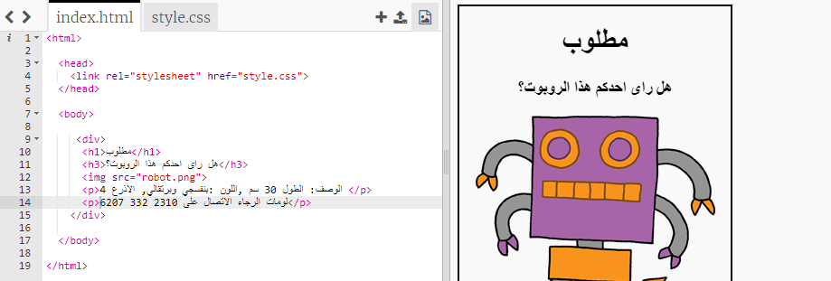
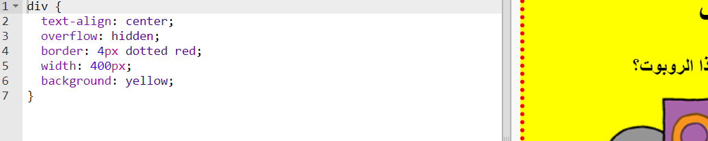

## تحديد أنماط الملصق

لنبدأ بتحرير كود CSS للملصق.

+ افتح مشروع trinket هذا: <a target="_blank" href="https://trinket.io/html/6f20d619b8">trinket.io/html/6f20d619b8</a>.
    
    يجب أن يبدو المشروع مثل هذا:
    
    

+ انقر فوق علامة التبويب "style.css". ستلاحظ أن هناك بالفعل خصائص CSS لـ `div` تحتوي على أجزاء مختلفة من الملصق.
    
        div {
            text-align: center;
            overflow: hidden;
            border: 2px solid black;
            width: 300px;
        }   
        

+ لنبدأ بتعديل ال `text-align` خاصية:
    
        محاذاة النص: المركز ؛;
        
    
    ماذا يحدث عند تغيير الكلمة ` الوسط` إلى ` اليسار` أو ` اليمين` ؟

+ ماذا عن خاصية `الحدود` ؟
    
        border: 2px solid black;
        
    
    `2px` في الكود أعلاه يعني 2 بكسل. ماذا يحدث عند تغيير `2 بكسل أسود صلب` إلى `4px منقط أحمر` ؟

+ تغيير عرض ` ` الملصق إلى `400 بكسل`. ماذا يحدث للملصق؟

+ دعنا نضيف بعض CSS لضبط لون خلفية الملصق. انتقل إلى نهاية السطر 5 من التعليمات البرمجية الخاصة بك واضغط على رجوع، بحيث يكون لديك سطر فارغ جديد.
    
    
    
    اكتب الكود التالي على السطر فارغ جديد:
    
        background: yellow;
        
    
    تأكد من كتابة الكود *بالضبط* كما هو أعلاه. يجب أن تلاحظ أن خلفية ال `
` أصبحت الآن صفراء.
    
    