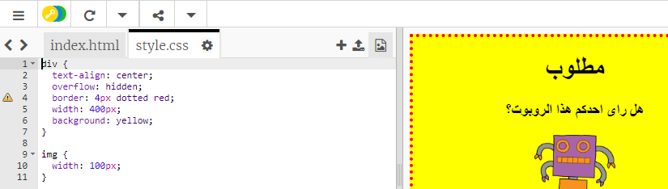

## تحديد أنماط الصور

لنحسِّن نمط الصورة الموجودة في الملصق.


+ إلى الآن، لا توجد أي خصائص CSS للوسم ``، لذا لنضِف بعض الخصائص!

	أولًا، أضف التعليمة البرمجية التالية أسفل تعليمات CSS البرمجية للوسم (div):

	```
	img {

	}
	```

	

+ يمكننا الآن إضافة خصائص CSS إلى الصور بين `` القوسّين المتعرِّجَين.

	على سبيل المثال، أضف هذه التعليمة البرمجية بين القوسين المتعرجين لتعيين عرض الصورة:

	```
	:width 100px;‎
	```

	سترى أن حجم الصورة تغيَّر ليصبح عرضها 100 بكسل.

	

+ يمكنك أيضًا إضافة حد حول الصورة باستخدام التعليمة البرمجية أدناه:

	```
	:border ;1px solid black
	```

+ هل لاحظتَ أنه لا توجد مساحة كافية تفصل بين الصورة والحد؟

	

	يمكنك إصلاح ذلك بإضافة حشو حول الصورة:

	```
	:padding 10px;‎
	```

	الحشو هو المساحة الفاصلة بين المحتوى (الصورة في هذه الحالة) وَحدِّه.

	

	في رأيك، ماذا سيحدث إذا غيَّرتَ قيمة الحشو إلى `50px`؟

