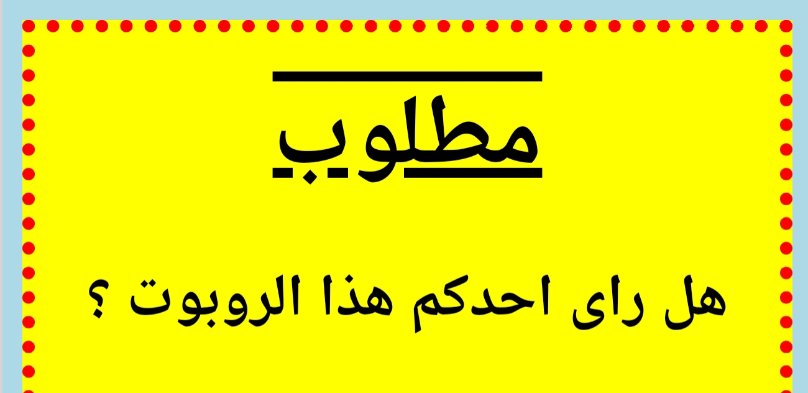

## تحديد أنماط العناوين

لنحسِّن نمط عنوان الوسم `<h1>`.


+ أضف التعليمة البرمجية التالية أسفل خصائص CSS للصورة:

	```
	h1 {

	}
	```

	ستضيف هنا خصائص CSS لعنوان `<h1>` الأساسي.

+ لتغيير خط عناوين الوسم `<h1>`، أضف التعليمة البرمجية التالية بين القوسين المتعرجين:

	```
	:font-family ;Impact
	```

+ يمكنك أيضًا تغيير حجم العنوان:

	```
	:font-size 50pt;‎
	```

+ 	هل لاحظتَ أن المساحة بين عنوان الوسم `<h1>` والعناصر الموجودة حوله كبيرة؟

	

	هذا لوجود هامش حول العنوان. والهامش هو المساحة التي تفصل بين العنصر (العنوان في هذه الحالة) والعناصر الأخرى الموجودة حوله.

	يمكنك تصغير هذا الهامش باستخدام التعليمة البرمجية التالية:

	```
	:margin 10px;‎
	```

	

+ يمكنك أيضًا وضع خط تحت العنوان:

	```
	;text-decoration: underline
	```

