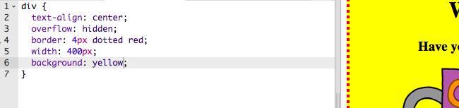

## Steilio'ch poster

Gadewch i ni ddechrau drwy olygu'r cod CSS ar gyfer y poster.

+ Agorwch y trinket hwn: <a target="_blank" href="http://jumpto.cc/web-wanted">jumpto.cc/web-wanted</a>.
    
    Dylai'r prosiect edrych fel hyn:
    
    

+ Cliciwch ar y tab "style.css". Byddwch yn sylwi bod yna eiddo CSS eisoes ar gyfer y `` sy'n cynnwys gwahanol rannau'r poster.
    
        div {
            testun-alinio: ganolfan;
            gorlif: cudd;
            ffin: 2px du solet;
            lled: 300px;
        }   
        

+ Gadewch i ni ddechrau drwy newid y `testun-alinio` eiddo:
    
        alinio testun: canolfan;
        
    
    Beth sy'n digwydd pan fyddwch chi'n newid y gair `canolfan` i `ôl` neu `dde`?

+ Beth am yr eiddo `ffin`?
    
        ffin: 2px solet du;
        
    
    `2px` yn y cod uchod yn golygu 2 bicsel. Beth sy'n digwydd pan fyddwch chi'n newid `2xx du du` i `px coch dot`?

+ Newidiwch `lled` y poster i `400px`. Beth sy'n digwydd i'r poster?

+ Gadewch i ni ychwanegu rhywfaint o CSS i osod lliw cefndir y poster. Ewch i ddiwedd llinell 5 o'ch cod a phwyswch y dychweliad, fel bod gennych linell wag newydd.
    
    
    
    Teipiwch y cod canlynol ar eich llinell wag newydd:
    
        cefndir: melyn;
        
    
    Gwnewch yn siŵr eich bod yn teipio yn y cod *yn union* fel y mae uchod. Dylech sylwi bod cefndir y `
` bellach yn felyn.
    
    