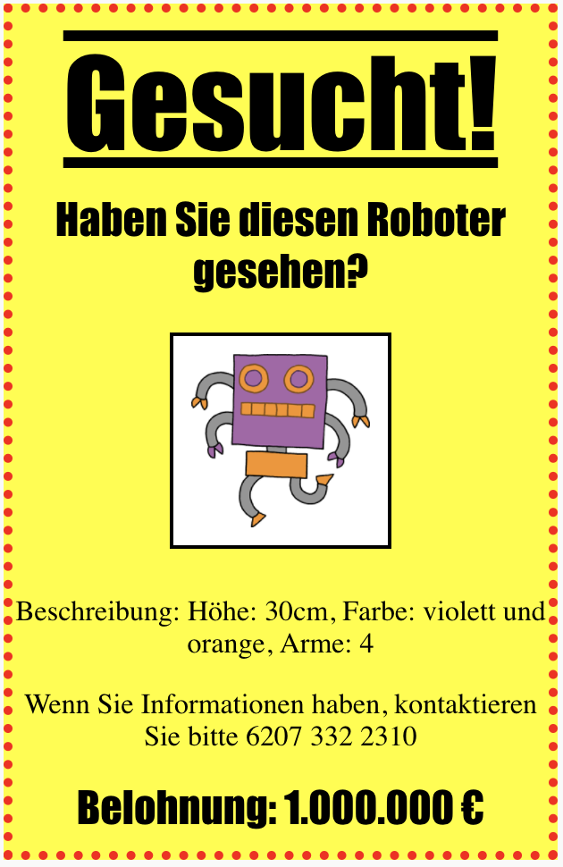

## Einleitung

In this project, you'll learn how to make your own poster.

### Zusätzliche Information für Clubleiter

Falls du dieses Projekt ausdrucken musst, verwende bitte die [druckfreundliche Version](https://projects.raspberrypi.org/en/projects/wanted/print).

## \--- collapse \---

## title: Anmerkungen für Clubleiter

## Einleitung:

In this project, children will have an opportunity to write their own CSS. They will also edit and write CSS properties and selectors to make their own poster.

## Online-Ressourcen

Wir empfehlen die Verwendung von [trinket](https://trinket.io/) um online HTML & CSS schreiben zu können. Dieses Projekt enthält folgende Trinkets:

* ['Wanted' starting point -- jumpto.cc/web-wanted](http://jumpto.cc/web-wanted)

Die Kinder können auch dieses leere Trinket [(jumpto.cc/html-blank)](http://jumpto.cc/html-blank) verwenden um ihr eigenes HTML & CSS zu schreiben, oder sie können als Alternative dazu dieses Trinket als Vorlage verwenden [(jumpto.cc/html-template)](http://jumpto.cc/html-template).

Es gibt auch ein Trinket mit einer Beispiellösung für die Herausforderungen:

* ['Wanted' Finished -- trinket.io/html/ebeb56398a](https://trinket.io/html/ebeb56398a)

## Offline-Ressourcen

Dieses Projekt kann wahlweise auch [offline](https://www.codeclubprojects.org/en-GB/resources/webdev-working-offline/) durchgeführt werden. Sie können auf die Projektressourcen zugreifen, indem Sie auf den Link "Projektmaterial" für dieses Projekt klicken. Dieser Link enthält einen Abschnitt "Projektressourcen" mit Ressourcen, die die Kinder benötigen, um das Projekt offline abschließen zu können. Stelle sicher, dass jedes Kind Zugriff auf eine Kopie dieser Ressourcen hat. Dieser Abschnitt enthält die folgenden Dateien:

* template/index.html
* template/style.css
* wanted/index.html
* wanted/style.css
* wanted/robot.png

Eine vollständige Version dieses Projekts finden Sie auch im Abschnitt "Ressourcen für Freiwillige". Diese enthält:

* wanted-finished/index.html
* wanted-finished/style.css
* wanted-finished/robot.png

(Alle oben genannten Ressourcen können auch als `.zip`-Dateien für Projekte und für Freiwillige heruntergeladen werden.)

## Lernziele

* This project gives children the opportunity to write their own CSS to style a webpage.

Dieses Projekt deckt die folgenden Kernbereiche des [Raspberry Pi Digital Making Curriculum](http://rpf.io/curriculum) ab:

* [Entwurf von grundlegenden 2D- and 3D-Konstruktionen](https://www.raspberrypi.org/curriculum/design/creator).

## Herausforderungen

* "Improving your poster" - adding new CSS properties to the `div` selector;
* "Improving your image" - adding new CSS properties to the `img` selector;
* "Make your poster awesome" - adding new CSS properties and new `h3` and `p` selectors;
* "Advertise an event" - Writing and editing HTML and CSS code.

\--- /collapse \---

## \--- collapse \---

## title: Projektmaterial

## Projektressourcen

* [.zip-Datei mit allen Projektressourcen](resources/wanted-project-resources.zip)
* [Online Trinket containing all 'Wanted!' project resources](http://jumpto.cc/web-wanted)
* [Online Trinket-Vorlage](http://jumpto.cc/trinket-template)
* [Leeres online-Trinket](http://jumpto.cc/trinket-blank)
* [template/index.html](resources/template-index.html)
* [template/style.css](resources/template-style.css)
* [wanted/index.html](resources/wanted-index.html)
* [wanted/style.css](resources/wanted-style.css)
* [wanted/robot.png](resources/wanted-robot.png)

## Ressourcen für Clubleiter

* [.zip-Datei mit allen fertig gestellten Projektressourcen](resources/wanted-volunteer-resources.zip)
* [Vollständiges Trinket-Projekt (online)](https://trinket.io/html/ebeb56398a)
* [wanted-finished/index.html](resources/wanted-finished-index.html)
* [wanted-finished/style.css](resources/wanted-finished-style.css)
* [twanted-finished/robot.png](resources/twanted-finished-robot.png)

\--- /collapse \---