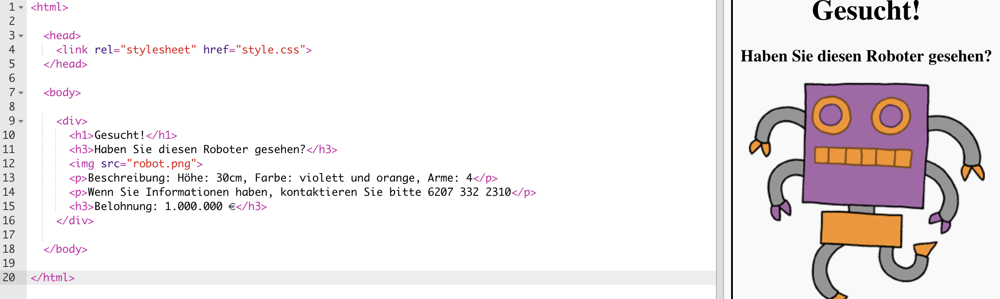
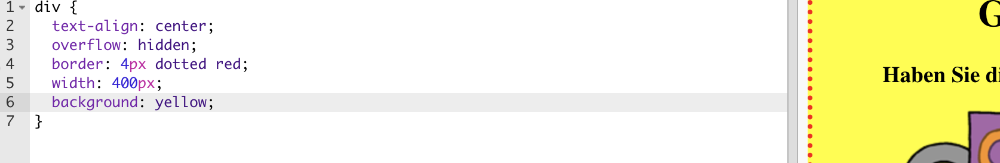

## Gestalte dein Poster

Lass uns damit beginnen, den CSS Code für das Poster zu bearbeiten.

+ Öffne diesen Trinket: <a target="_blank" href="https://trinket.io/html/e52d06ba77">trinket.io/html/e52d06ba77</a>.
    
    Das Projekt sollte so aussehen:
    
    

+ Klicke auf den “style.css” Reiter. Du wirst sehen, dass es bereits CSS Eigenschaften für `div` gibt, welche die verschiedenen Teile des Posters enthalten.
    
        div {
            text-align: center;
            overflow: hidden;
            border: 2px solid black;
            width: 300px;
        }   
        

+ Lass uns damit beginnen, die `text-align` (Textausrichtung) Eigenschaften zu verändern:
    
        text-align: center;
        
    
    Was passiert, wenn du das Wort center `center` (Mitte) zu `left` (links) oder `right` (rechts) änderst?

+ Wie sieht es mit der `border` (Rand) Eigenschaft aus?
    
        border: 2px solid black;
        
    
    `2px` in dem obigen Code bedeutet 2 Pixel. Was passiert, wenn du `2px solid black` (2px durchgehend schwarz) zu `4px dotted red` (4px gepunktet rot) änderst?

+ Ändere die `width` (Breite) zu `400px`. Was geschieht dann mit dem Poster?

+ Lass uns jetzt CSS hinzufügen, um die Hintergrundfarbe des Posters zu gestalten. Gehe zum Ende der Zeile 5 deines Codes und drücke die Eingabetaste, damit du eine neue, leere Zeile erhältst.
    
    
    
    Tippe den folgenden Code in deine neue, leere Zeile ein:
    
        background: yellow;
        
    
    Achte darauf, dass du den Code *exakt* so eintippst, wie er oben geschrieben ist. Du solltest jetzt bemerken, dass der Hintergrund von `
` nun gelb ist.
    
    