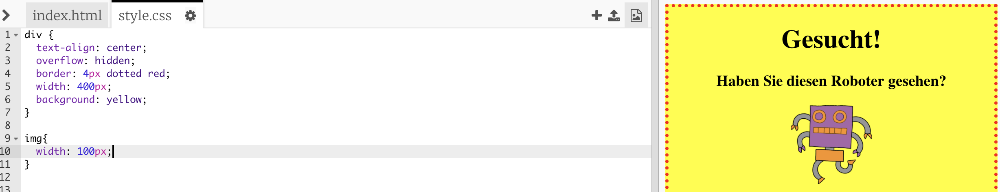

## Bilder gestalten

Lass uns den Stil des Posterbilds verbessern.

+ Derzeit gibt es keine CSS Eigenschaften für dein `` Tag, lass uns also einige hinzufügen!
    
    Als Erstes, füge den folgenden Code unterhalb des CSS für dein div hinzu:
    
        img {
        
        }
        
    
    

+ Wir können jetzt die CSS Eigenschaften für Bilder zwischen den geschweiften Klammern setzen.
    
    Zum Beispiel: Füge diesen Code zwischen die geschweiften Klammern ein, um die Bildbreite einzustellen:
    
        width: 100px;
        
    
    Du wirst sehen, dass sich die Bildgröße verändern wird, sodass die Bildbreite jetzt 100 Pixel beträgt.
    
    

+ Du kannst auch mit Hilfe dieses Codes einen Rand rund um das Bild machen:
    
        border: 1px solid black;
        

+ Hast du bemerkt, dass nicht viel Platz zwischen dem Bild und dem Rand besteht?
    
    
    
    Du kannst dies beheben, indem du etwas Füllung rund um das Bild einfügst:
    
        padding: 10px;
        
    
    Padding ist der Raum zwischen dem Inhalt (in diesem Fall ein Bild) und dessen Rand.
    
    
    
    Was meinst du wird passieren, wenn du die Füllung zu `50px` veränderst?