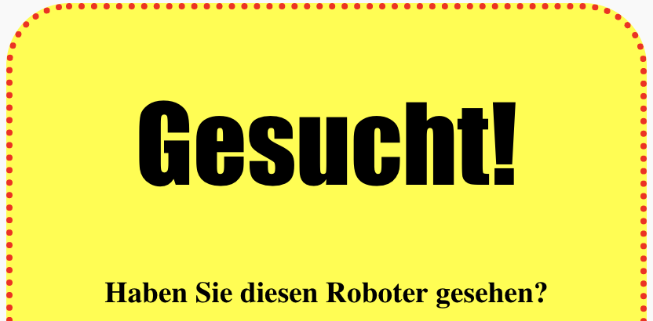
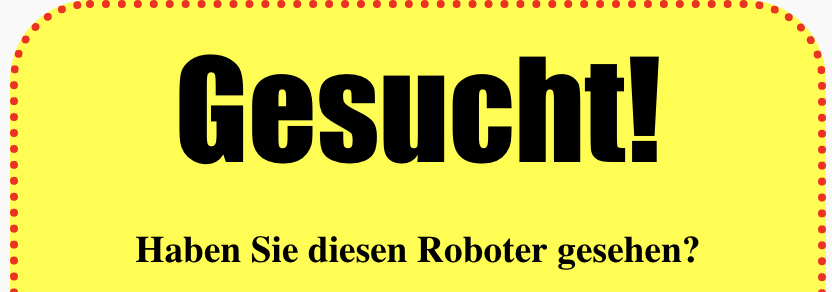

## Überschriftsstile

Lass uns den Stil der `<h1>` Überschrift verbessern.

+ Füge den folgenden Code unter dem CSS deines Bildes hinzu:

	```
	h1 {

	}
	```

	Hier ist der Platz, an dem du alle CSS Eigenschaften für deine Hauptüberschrift `<h1>` einfügst.

+ Um die Schriftart deiner `<h1>` Hauptüberschrift zu ändern, kannst du den folgenden Code zwischen die geschweiften Klammern setzen:

	```
	Schriftart: Impact;
	```

+ Du kannst auch die Schriftgröße der Überschrift ändern:

	```
	Schriftgröße: 50pt;
	```

+ 	Hast du bemerkt, dass es einen großen Freiraum zwischen der `<h1>` Überschrift und den Dingen rund herum gibt?

	

	Das liegt daran, dass es eine Grenze rund um die Überschrift gibt. Eine Grenze ist der Platz zwischen einem Element (in diesem Fall die Überschrift) und den anderen Dingen drum herum.

	Du kannst die Grenze mit Hilfe dieses Codes kleiner machen:

	```
	Grenze: 10px;
	```

	

+ Du kannst deine Überschrift auch unterstreichen:

	```
	Textdekoration: unterstreichen;
	```

