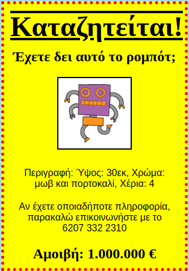

## Εισαγωγή

Σε αυτό το έργο, θα μάθεις πώς να φτιάξεις τη δική σου αφίσα.

### Πρόσθετες πληροφορίες για τους συντονιστές των ομάδων

Αν χρειαστεί να εκτυπώσεις αυτό το έργο, χρησιμοποίησε την [εκτυπώσιμη έκδοση](https://projects.raspberrypi.org/en/projects/wanted/print).

## \--- collapse \---

## title: Σημειώσεις συντονιστή ομάδας

## Εισαγωγή:

Σε αυτό το έργο, τα παιδιά θα έχουν την ευκαιρία να γράψουν τη δική τους CSS. Επίσης θα επεξεργαστούν και θα γράψουν CSS ιδιότητες και επιλογές για να φτιάξουν τη δική τους αφίσα.

## Online Πόροι

Συνιστούμε να χρησιμοποιήσετε την εφαρμογή [trinket](https://trinket.io/) για να γράψετε HTML & CSS online. Το έργο αυτό περιλαμβάνει τα ακόλουθα trinkets:

* ['Καταζητείται' αρχικό στάδιο -- jumpto.cc/web-wanted](http://jumpto.cc/web-wanted)

Τα παιδιά μπορούν επίσης να χρησιμοποιήσουν αυτό το κενό trinket [(jumpto.cc/html-blank)](http://jumpto.cc/html-blank) για να γράψουν το δικό τους HTML & CSS κώδικα, ή εναλλακτικά αυτό το trinket πρότυπο [(jumpto.cc/html-template)](http://jumpto.cc/html-template).

Υπάρχει επίσης ένα trinket που περιέχει μια υποδειγματική λύση στις προκλήσεις:

* ['Καταζητείται' Ολοκληρωμένο -- trinket.io/html/ebeb56398a](https://trinket.io/html/ebeb56398a)

## Offline Πόροι

Αυτό το έργο μπορεί να [ολοκληρωθεί χωρίς σύνδεση](https://www.codeclubprojects.org/en-GB/resources/webdev-working-offline/) αν προτιμάς. Μπορείς να αποκτήσεις πρόσβαση στους πόρους του έργου κάνοντας κλικ στο σύνδεσμο 'Υλικό έργου'. Αυτός ο σύνδεσμος περιέχει μια ενότητα 'Πόροι έργου', η οποία περιλαμβάνει πόρους που τα παιδιά θα χρειαστούν για να ολοκληρώσουν αυτό το έργο εκτός σύνδεσης. Βεβαιωθείτε ότι κάθε παιδί έχει πρόσβαση σε ένα αντίγραφο αυτών των πόρων. Αυτή η ενότητα περιλαμβάνει τα ακόλουθα αρχεία:

* template/index.html
* template/style.css
* wanted/index.html
* wanted/style.css
* wanted/robot.png

Μπορείτε επίσης να βρείτε μια ολοκληρωμένη έκδοση των προκλήσεων αυτού του έργου στην ενότητα 'Πόροι εθελοντών', η οποία περιέχει:

* wanted-finished/index.html
* wanted-finished/style.css
* wanted-finished/robot.png

(Όλοι οι παραπάνω πόροι μπορούν επίσης να μεταφορτωθούν ως συμπιεσμένα `.zip` αρχεία.)

## Στόχοι μάθησης

* Το έργο αυτό δίνει στα παιδιά την ευκαιρία να γράψουν το δικό τους κώδικα CSS για να σχεδιάσουν μία ιστοσελίδα.

Αυτό το έργο καλύπτει στοιχεία από τις ακόλουθες πτυχές του [Raspberry Pi Digital Curriculum Making](http://rpf.io/curriculum):

* [Σχεδιασμός βασικών στοιχείων 2D και 3D](https://www.raspberrypi.org/curriculum/design/creator).

## Προκλήσεις

* "Βελτίωση της αφίσας σου" - προσθέτοντας νέες ιδιότητες CSS στον επιλογέα `div`.
* "Βελτίωση της εικόνας σου" - προσθέτοντας νέες ιδιοτήτες CSS στον επιλογέα `img`.
* "Κάνε την αφίσα σου εντυπωσιακή" - προσθέτοντας νέες ιδιότητες CSS και νέους επιλογείς `h3` και `p`.
* "Διαφήμισε μια εκδήλωση" - Γράψε και επεξεργάσου HTML και CSS κώδικα.

\--- /collapse \---

## \--- collapse \---

## title: Υλικό έργου

## Project resources

* [.zip file containing all project resources](resources/wanted-project-resources.zip)
* [Online Trinket containing all 'Wanted!' project resources](http://jumpto.cc/web-wanted)
* [Online Trinket template](http://jumpto.cc/trinket-template)
* [Online blank Trinket](http://jumpto.cc/trinket-blank)
* [template/index.html](resources/template-index.html)
* [template/style.css](resources/template-style.css)
* [wanted/index.html](resources/wanted-index.html)
* [wanted/style.css](resources/wanted-style.css)
* [wanted/robot.png](resources/wanted-robot.png)

## Club leader resources

* [.zip file containing all completed project resources](resources/wanted-volunteer-resources.zip)
* [Online completed Trinket project](https://trinket.io/html/ebeb56398a)
* [wanted-finished/index.html](resources/wanted-finished-index.html)
* [wanted-finished/style.css](resources/wanted-finished-style.css)
* [twanted-finished/robot.png](resources/twanted-finished-robot.png)

\--- /collapse \---