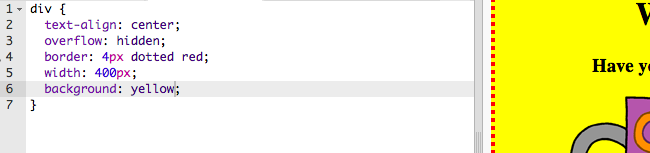

## Σχεδίαση της αφίσας σου

Ας αρχίσουμε με την επεξεργασία του κώδικα CSS για την αφίσα.

+ Άνοιξε αυτό το trinket: <a target="_blank" href="http://jumpto.cc/web-wanted">jumpto.cc/web-wanted</a>.
    
    Το έργο πρέπει να μοιάζει έτσι:
    
    

+ Κάνε κλικ στην καρτέλα "style.css". Θα παρατηρήσεις ότι υπάρχουν ήδη ιδιότητες CSS για το `div` που περιέχει τα διάφορα μέρη της αφίσας.
    
        div {
            text-align: center;
            overflow: hidden;
            border: 2px solid black;
            width: 300px;
        }   
        

+ Ας ξεκινήσουμε τροποποιώντας την ιδιότητα `text-align`:
    
        text-align: center;
        
    
    Τι συμβαίνει όταν αλλάζεις τη λέξη `center` σε `left` ή `right`;

+ Τι λες για την ιδιότητα `border`;
    
        border: 2px solid black;
        
    
    `2px` στον ανωτέρω κώδικα σημαίνει 2 εικονοστοιχεία. Τι συμβαίνει όταν αλλάζεις την τιμή `2px solid black` σε `4px dotted red`;

+ Άλλαξε την ιδιότητα `width` σε `400px`. Τι συμβαίνει με την αφίσα;

+ Ας προσθέσουμε κώδικα CSS για να ρυθμίσεις το χρώμα φόντου της αφίσας. Πήγαινε στο τέλος της γραμμής 5 του κώδικα και πάτησε Enter για να έχεις μια νέα κενή γραμμή.
    
    
    
    Πληκτρολόγησε τον παρακάτω κώδικα στη νέα κενή γραμμή:
    
        background: yellow;
        
    
    Βεβαιώσου ότι πληκτρολογείς τον κώδικα *ακριβώς* όπως είναι παραπάνω. Θα πρέπει να παρατηρήσεις ότι το φόντο του `
` είναι τώρα κίτρινο.
    
    