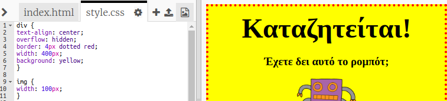

## Σχεδίαση εικόνων

Ας βελτιώσουμε το στυλ της εικόνας στην αφίσα.

+ Προς το παρόν, δεν υπάρχουν ιδιότητες CSS για την ετικέτα ``, οπότε ας προσθέσουμε μερικές!
    
    Αρχικά, πρόσθεσε τον παρακάτω κώδικα κάτω από το div:
    
        img {
        
        }
        
    
    

+ We can now add CSS properties for images between the curly brackets.
    
    Για παράδειγμα, πρόσθεσε αυτόν τον κώδικα ανάμεσα στα άγκιστρα για να ορίσεις το πλάτος της εικόνας:
    
        width: 100px;
        
    
    Θα δεις ότι το μέγεθος της εικόνας αλλάζει, έτσι ώστε το πλάτος της να είναι 100 εικονοστοιχεία.
    
    

+ Μπορείς επίσης να προσθέσεις ένα περίγραμμα γύρω από την εικόνα με αυτόν τον κώδικα:
    
        border: 1px solid black;
        

+ Παρατήρησες ότι δεν υπάρχει πολύς χώρος ανάμεσα στην εικόνα και στο περίγραμμα;
    
    
    
    Μπορείς να το διορθώσεις προσθέτοντας λίγο χώρο γύρω από την εικόνα:
    
        padding: 10px;
        
    
    Η ιδιότητα padding είναι ο χώρος μεταξύ του περιεχομένου (στην περίπτωση αυτή της εικόνας) και του περιγράμματός του.
    
    
    
    Τι νομίζεις ότι θα συνέβαινε εάν άλλαζες την ιδιότητα padding σε `50px`;