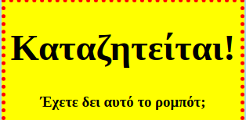
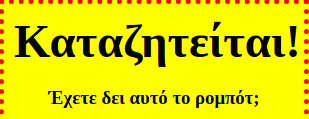

## Σχεδίαση τίτλων

Ας βελτιώσουμε το στυλ της επικεφαλίδας `<h1>`.

+ Πρόσθεσε τον παρακάτω κώδικα κάτω από το CSS της εικόνας σου:
    
        h1 {
        
        }
        
    
    Εδώ θα προσθέσεις ιδιότητες CSS για την κύρια επικεφαλίδα `<h1>`.

+ Για να αλλάξεις τη γραμματοσειρά των `<h1>` επικεφαλίδων, πρόσθεσε τον ακόλουθο κώδικα ανάμεσα στα άγκιστρα:
    
        font-family: Impact;
        

+ Μπορείς επίσης να αλλάξεις το μέγεθος της επικεφαλίδας:
    
        font-size: 50pt;
        

+ Παρατηρήσες ότι υπάρχει μεγάλος χώρος ανάμεσα στην επικεφαλίδα `<h1>` και τα στοιχεία γύρω της;
    
    
    
    Αυτό οφείλεται στο γεγονός ότι υπάρχει περιθώριο γύρω από την επικεφαλίδα. Το περιθώριο είναι ο χώρος μεταξύ του στοιχείου (στην περίπτωση αυτή της επικεφαλίδας) και των άλλων στοιχείων γύρω από αυτό.
    
    Μπορείς να κάνεις το περιθώριο μικρότερο με αυτόν τον κώδικα:
    
        margin: 10px;
        
    
    

+ Μπορείς επίσης να υπογραμμίσεις την επικεφαλίδα σου:
    
        text-decoration: underline;