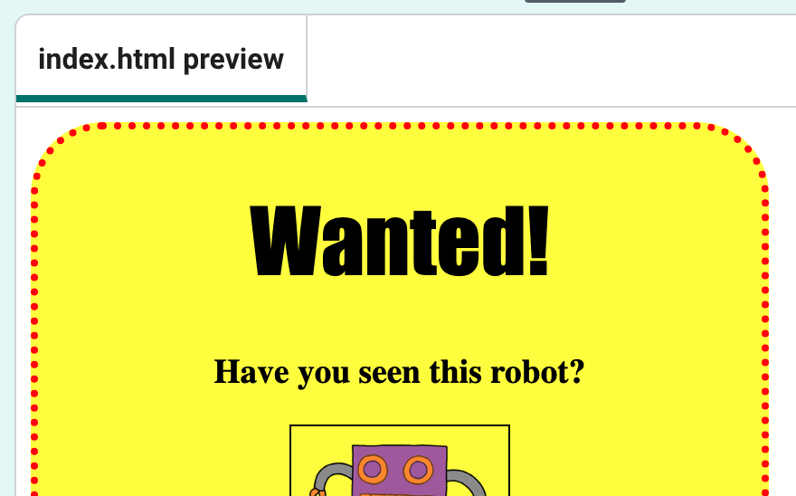
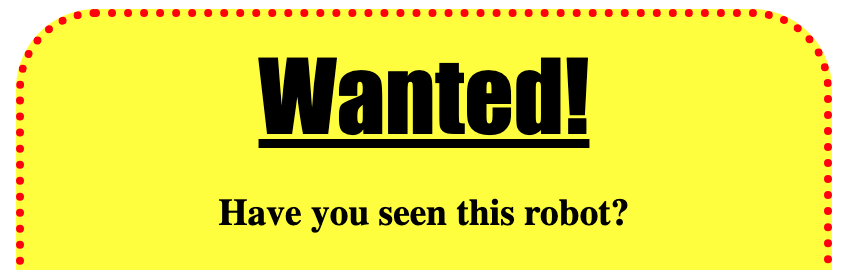

## Styling headings

--- task ---

Add another CSS style at the bottom of your file, this time for `h1` which is a heading:

--- code ---
---
language: css
line_numbers: true
line_number_start: 9
line_highlights: 14-16
---
img {
	width: 100px;
  	border: 1px solid black;
  	padding: 10px;
}
h1 {

}
--- /code ---

--- /task ---

--- task ---

Add a style rule to change the font of the heading, then press **Run** to see the changes.

--- code ---
---
language: css
line_numbers: true
line_number_start: 14
line_highlights: 15
---
h1 {
	font-family: Impact;
}
--- /code ---

--- /task ---

--- task ---
Now add another rule to change the size of the heading, then press **Run** to see the changes.

--- code ---
---
language: css
line_numbers: true
line_number_start: 14
line_highlights: 16
---
h1 {
	font-family: Impact;
	font-size: 3em;
}
--- /code ---

--- /task ---

Have you noticed that there's a big space between the `<h1>` heading and the other text?

This is because there's a margin around the heading. A margin is the space between the element (in this case a heading) and the other things on the page.

--- task ---
Add a style to make the margin of the heading smaller, then press **Run** to see the changes.

--- code ---
---
language: css
line_numbers: true
line_number_start: 14
line_highlights: 17
---
h1 {
	font-family: Impact;
	font-size: 3em;
	margin: 10px;
}
--- /code ---

--- /task ---

--- task ---
Finally,  add a style to underline the heading, then press **Run** to see the changes.

--- code ---
---
language: css
line_numbers: true
line_number_start: 14
line_highlights: 18
---
h1 {
	font-family: Impact;
	font-size: 3em;
	margin: 10px;
	text-decoration: underline;
}
--- /code ---

--- /task ---