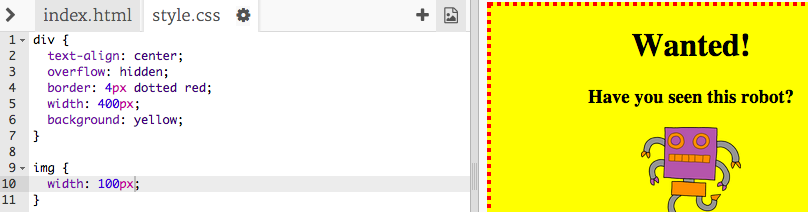

## Styling images

Let's improve the style of the image in the poster.


+ At the moment, there aren't any CSS properties for your `` tag, so let's add some!

	Firstly, add the following code underneath the CSS for your div:

	```
	img {

	}
	```

	

+ We can now add CSS properties for images between the curly brackets.

	For example, add this code between the curly brackets to set the width of the image:

	```
	width: 100px;
	```

	You'll see that the size of the image changes, so that its width is 100 pixels.

	

+ You can also add a border around the image with this code:

	```
	border: 1px solid black;
	```

+ Have you noticed that there's not much space between the image and the border?

	

	You can fix this by adding some padding around the image:

	```
	padding: 10px;
	```

	Padding is the space between the content (in this case an image) and its border.

	

	What do you think would happen if you changed the padding to `50px`?
