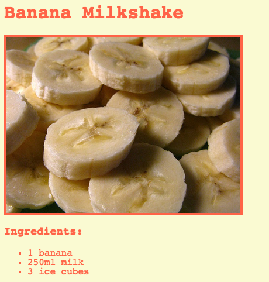

## What can you do now?

If you are following the [HTML & CSS: Module 1](https://projects.raspberrypi.org/en/pathways/webdev-module-1) pathway, you can move on to the [Recipe](https://projects.raspberrypi.org/en/projects/recipe/) project. In this project, you will learn how to create a webpage for your favourite recipe.

--- print-only --- 

--- /print-only ---

--- no-print ---

<iframe src="https://editor.raspberrypi.org/en/embed/viewer/recipe-starter" width="600" height="600" frameborder="0" marginwidth="0" marginheight="0" allowfullscreen>
</iframe>

--- /no-print ---

Or, why not try out another [HTML](https://projects.raspberrypi.org/en/projects?software%5B%5D=html-css-javascript) project.