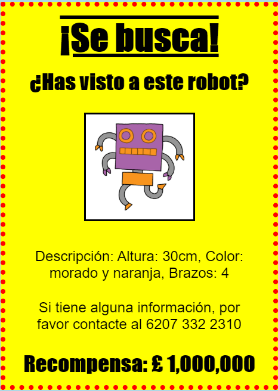

## Introducción

En este proyecto, aprenderás cómo hacer tu propio póster.

### Información adicional para los líderes de los clubes

Si necesitas imprimir este proyecto, usa la [versión para imprimir](https://projects.raspberrypi.org/en/projects/wanted/print).

## \--- collapse \---

## title: Notas para el líder del club

## Introducción:

En este proyecto, los niños tendrán la oportunidad de escribir su propio CSS. También editarán y escribirán las propiedades y los selectores de CSS para hacer su propio póster.

## Recursos en línea

Recomendamos el uso de [ trinket](https://trinket.io/) para escribir HTML & CSS en línea. Este proyecto contiene los siguientes trinkets:

* [Punto de partida 'Se busca' - jumpto.cc/web-wanted](http://jumpto.cc/web-wanted)

Los niños también pueden hacer uso de este trinket en blanco [(jumpto.cc/html-blank)](http://jumpto.cc/html-blank) para escribir su propio HTML & CSS, o alternativamente pueden usar este trinket plantilla [(jumpto.cc/html-template)](http://jumpto.cc/html-template).

También hay un trinket que contiene una solución de muestra para los desafíos:

* ['Se busca' terminado -- trinket.io/html/ebeb56398a](https://trinket.io/html/ebeb56398a)

## Recursos sin conexión

Este proyecto se puede [completar sin conexión](https://www.codeclubprojects.org/en-GB/resources/webdev-working-offline/) si se prefiere. Puedes acceder a los recursos del proyecto haciendo clic en el enlace 'Materiales del proyecto' en este proyecto. Este enlace contiene una sección de 'Recursos del proyecto', que incluye los recursos que los niños necesitarán para completar este proyecto sin conexión. Asegúrate de que cada niño tenga acceso a una copia de estos recursos. Esta sección incluye los siguientes archivos:

* template/index.html
* template/style.css
* wanted/index.html
* wanted/style.css
* wanted/robot.png

También puedes encontrar una versión completa de los desafíos de este proyecto en la sección 'Recursos para voluntarios', que contiene:

* wanted-finished/index.html
* wanted-finished/style.css
* wanted-finished/robot.png

(Todos los recursos anteriores también se pueden descargar como archivos `.zip` de proyectos y voluntarios.)

## Objetivos del Aprendizaje

* Este proyecto les brinda a los niños la oportunidad de escribir su propio CSS para diseñar una página web.

Este proyecto incluye elementos de los siguientes aspectos del [Currículo de creación digital de Raspberry Pi](http://rpf.io/curriculum):

* [Diseño de elementos básicos en 2D y 3D](https://www.raspberrypi.org/curriculum/design/creator).

## Desafíos

* "Mejorando tu cartel" - añadiendo nuevas propiedades CSS al selector `div`;
* "Mejorando tu imagen" - añadiendo nuevas propiedades CSS al selector `img`;
* "Haz que tu poster sea impresionante" - añadiendo nuevas propiedades CSS y nuevos selectores `h3` y `p`;
* "Anunciar un evento" - Escribir y editar código HTML y CSS.

\--- /collapse \---

## \--- collapse \---

## title: Materiales del proyecto

## Recursos del proyecto

* [Archivo .zip que contiene todos los recursos del proyecto](https://rpf.io/p/en/wanted-go)
* [Trinket en línea que contiene todos los recursos del proyecto '¡Se busca!'](http://jumpto.cc/web-wanted)
* [Plantilla de Trinket en línea](http://jumpto.cc/trinket-template)
* [Trinket en blanco en línea](http://jumpto.cc/trinket-blank)
* [template/index.html](resources/template-index.html)
* [template/style.css](resources/template-style.css)
* [wanted/index.html](resources/wanted-index.html)
* [wanted/style.css](resources/wanted-style.css)
* [wanted/robot.png](resources/wanted-robot.png)

## Recursos para los líderes de los clubes

* [Archivo .zip que contiene todos los recursos de proyecto terminado](https://rpf.io/p/en/wanted-go)
* [Proyecto Trinket terminado en línea](https://trinket.io/html/ebeb56398a)
* [wanted-finished/index.html](resources/wanted-finished-index.html)
* [wanted-finished/style.css](resources/wanted-finished-style.css)
* [wanted-finished/style.css](resources/twanted-finished-robot.png)

\--- /collapse \---