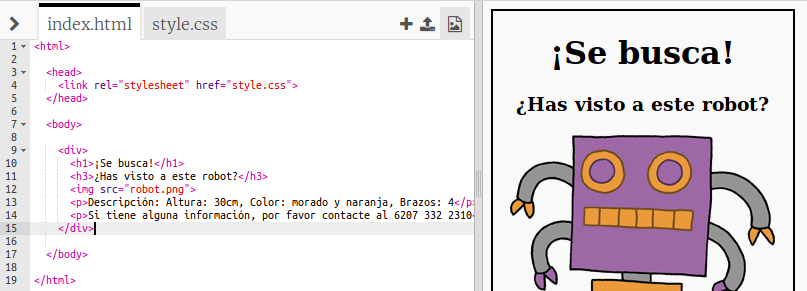
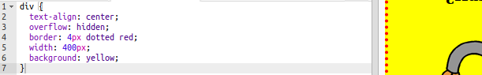

## Diseño de tu cartel

Comencemos editando el código CSS para el cartel.

+ Abre este Trinket: <a target="_blank" href="http://jumpto.cc/web-wanted">jumpto.cc/web-wanted</a>.
    
    El proyecto debería parecerse a esto:
    
    

+ Haz clic en la pestaña "style.css". Notarás que ya hay propiedades CSS para `div ` conteniendo las diferentes partes del cartel.
    
        div {
            text-align: center;
            overflow: hidden;
            border: 2px solid black;
            width: 300px;
        }   
        

+ Empecemos por alterar la propiedad `text-align`:
    
        text-align: center;
        
    
    ¿Qué pasa cuando cambias la palabra `center` a `left` o `right`?

+ ¿Qué hay de la propiedad `border`?
    
        border: 2px solid black;
        
    
    `2px` en el código anterior significa 2 píxeles. ¿Qué sucede cuando cambias `2px solid black` a `4px dotted red`?

+ Cambia el `width` (ancho) del cartel a `400px`. ¿Qué pasa con el cartel?

+ Vamos a añadir algo de CSS para establecer el color de fondo del cartel. Ve al final de la línea 5 de tu código y presiona Intro para tener una nueva línea en blanco.
    
    
    
    Escribe el siguiente código en tu nueva línea en blanco:
    
        background: yellow;
        
    
    Make sure that you type in the code *exactly* as it is above. You should notice that the background of the `
` is now yellow.
    
    