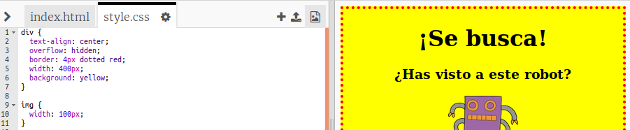

## Diseño de las imágenes

Mejoremos el estilo de la imagen en el cartel.

+ En este momento, no hay propiedades CSS para su etiqueta ``, ¡así que vamos a añadir algunas!
    
    En primer lugar, añade el siguiente código debajo del CSS para su div:
    
        img {
        
        }
        
    
    

+ We can now add CSS properties for images between the curly brackets.
    
    For example, add this code between the curly brackets to set the width of the image:
    
        width: 100px;
        
    
    You'll see that the size of the image changes, so that its width is 100 pixels.
    
    

+ You can also add a border around the image with this code:
    
        border: 1px solid black;
        

+ Have you noticed that there's not much space between the image and the border?
    
    
    
    You can fix this by adding some padding around the image:
    
        padding: 10px;
        
    
    Padding is the space between the content (in this case an image) and its border.
    
    
    
    What do you think would happen if you changed the padding to `50px`?