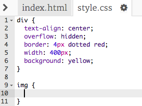

## Diseño de las imágenes

Mejoremos el estilo de la imagen en el cartel.

+ En este momento, no hay propiedades CSS para tu etiqueta ``, ¡así que vamos a añadir algunas!
    
    Primero, añade el siguiente código debajo del CSS para su div:
    
        img {
        
        }
        
    
    

+ Ahora podemos añadir propiedades CSS para las imágenes entre los corchetes.
    
    Por ejemplo, añade este código entre los corchetes para establecer el ancho de la imagen:
    
        width: 100px;
        
    
    Verás que el tamaño de la imagen cambia, de modo que su ancho es de 100 píxeles.
    
    

+ También puedes añadir un borde alrededor de la imagen con este código:
    
        border: 1px solid black;
        

+ ¿Te has dado cuenta de que no hay mucho espacio entre la imagen y el borde?
    
    
    
    You can fix this by adding some padding around the image:
    
        padding: 10px;
        
    
    Padding is the space between the content (in this case an image) and its border.
    
    
    
    What do you think would happen if you changed the padding to `50px`?