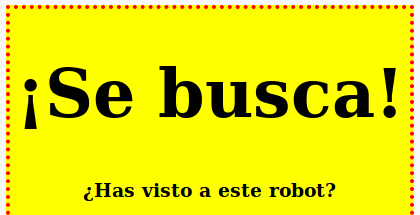

## Diseño de encabezados

Mejoremos el estilo del encabezado `<h1>`.

+ Añade el siguiente código debajo del CSS de tu imagen:
    
        h1 {
        
        }
        
    
    Aquí es donde añadirás las propiedades CSS para su encabezado principal `<h1>`.

+ Para cambiar la fuente de sus encabezados `<h1>`, añade el siguiente código entre los corchetes:
    
        font-family: Impact;
        

+ También puedes cambiar el tamaño del encabezado:
    
        font-size: 50pt;
        

+ ¿Te has dado cuenta de que hay un gran espacio entre el encabezado `<h1>` y las cosas que lo rodean?
    
    
    
    Esto se debe a que hay un margen alrededor del encabezado. Un margen es el espacio entre el elemento (en este caso un encabezado) y las otras cosas que lo rodean.
    
    Puedes hacer el margen más pequeño con este código:
    
        margin: 10px;
        
    
    

+ También puedes subrayar tu título:
    
        text-decoration: underline;