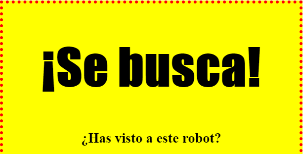

## Dar estilo a los encabezados

Vamos a mejorar el estilo del encabezado `<h1>`.

+ Añade el siguiente código por debajo del CSS de tu imagen:

	```
	h1 {

	}
	```

	Aquí es donde añadirás las propiedades de CSS para tu encabezado principal `<h1>`.

+ Para cambiar la fuente de tus encabezados `<h1>`, añade el siguiente código entre las llaves:

	```
	font-family: Impact;
	```

+ También puedes cambiar el tamaño del encabezado:

	```
	font-size: 50pt;
	```

+ 	¿Te has dado cuenta de que hay mucho espacio entre el encabezado `<h1>` y el resto de los elementos a su alrededor?

	

	Esto sucede porque hay un margen alrededor del encabezado. El margen es el espacio entre el elemento (en este caso el encabezado) y el resto de cosas a su alrededor.

	Puedes reducir el margen con este código:

	```
	margin: 10px;
	```

	

+ También puedes subrayar el encabezado:

	```
	text-decoration: underline;
	```
