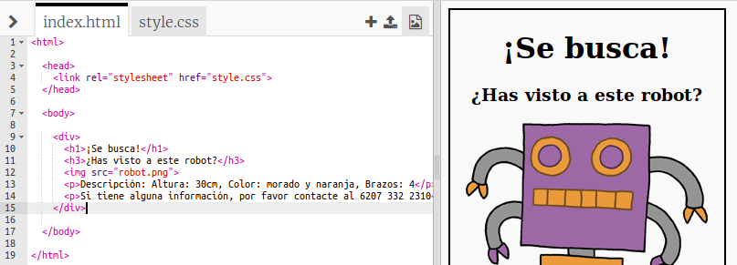
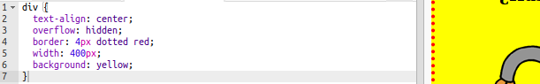

## Dando estilo a tu póster

Empecemos editando el codigo CSS para el póster.

+ Abre este trinket: <a target="_blank" href="https://trinket.io/html/6b5fc5b622">trinket.io/html/6b5fc5b622</a>.
    
    El proyecto deberá parecerse a esto:
    
    

+ Haz clic en la pestaña "style.css". Notarás que ya hay propiedades CSS para `div` conteniendo las diferentes partes del cartel.
```    
        div {
            text-align: center;
            overflow: hidden;
            border: 2px solid black;
            width: 300px;
        }   
```        

+ Empecemos por modificar la propiedad `text-align`:
```    
        text-align: center;
```        
    
    ¿Qué pasa cuando cambias la palabra `center` a `left` o `right`?

+ ¿Qué hay de la propiedad `border`?
```    
        border: 2px solid black;
```        
    
    `2px` en el código anterior significa 2 píxeles. ¿Qué pasa cuando cambias `2px solid black` a `4px dotted red`?

+ Cambia el valor de la propiedad `width` del póster a `400px`. ¿Qué pasa con el póster?

+ Vamos a añadir algo de código CSS para establecer el color de fondo del póster. Ve al final de la línea 5 de tu código y presiona Intro para tener una nueva línea en blanco.
    
    
    
    Escribe el siguiente código en tu nueva línea en blanco:
    ```
        background: yellow;
    ```    
    
    Asegúrate de escribir el código *exactamente* como está arriba. Debes notar que el fondo del `<div>` ahora es amarillo.
    
    