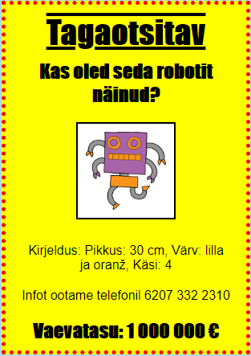

## Sissejuhatus

Selles projektis saad teada, kuidas luua omaenda plakat.

### Lisainfo ringijuhendajatele

Kui sul on vaja see projekt välja printida, siis kasuta [printerisõbralikku versiooni](https://projects.raspberrypi.org/en/projects/wanted/print).

## \--- collapse \---

## title: Ringijuhendaja märkmed

## Sissejuhatus:

Selles projektis on lastel võimalus kirjutada oma CSS. Samuti muudavad ja kirjutavad nad CSS-i omadusi ja selektoreid oma plakati tegemiseks.

## Internetiressursid

HTML-i & CSS-i kasutamiseks veebis soovitame kasutada [trinketit](https://trinket.io/). See projekt sisaldab järgmisi trinketeid:

* ["Tagaotsitava" lähtepunkt - jumpto.cc/web-wanted](http://jumpto.cc/web-wanted)

Lapsed võivad kasutada ka seda tühja trinketit [(jumpto.cc/html- blank)](http://jumpto.cc/html-blank) oma HTML-i & CSS-i kirjutamiseks või alternatiivina saavad nad kasutada seda näidistrinketit [(jumpto.cc/html-memplate)](http://jumpto.cc/html-template).

Leidub ka trinket, mis sisaldab näidislahendust väljakutsetele:

* ['Tagaotsitav' Lõpetatud - trinket.io/html/ebeb56398a](https://trinket.io/html/ebeb56398a)

## Võrguvälised ressursid

Selle projekti saab soovi korral [lõpetada võrguühenduseta](https://www.codeclubprojects.org/en-GB/resources/webdev-working-offline/). Saad ligipääsu projekti ressurssidele, klõpsates selle projekti "Projekti materjalide" lingil. See link sisaldab jaotise "Projektide ressursid", mis sisaldab ressursse, mida lapsed peavad selle projekti väljalülitamiseks lõpule viima. Veenduge, et igal lapsel on juurdepääs nende ressursside koopiale. See jaotis sisaldab järgmisi faile:

* mall / indeks.html
* mall / style.css
* soovis / index.html
* wanted / style.css
* wanted / robot.png

Selle projekti väljakutsete täieliku versiooni leiate ka jaotisest "Vabatahtlike ressursid", mis sisaldab järgmist:

* soovitud-lõpetatud / index.html
* soovitud-lõpetatud / style.css
* soovitud-lõpetatud / robot.png

(Kõik ülaltoodud allikad on samuti alla laaditavad kui projekti ja vabatahtlikud `.zip` failid.)

## Õppe eesmärgid

* See projekt annab lastele võimaluse oma veebilehe kujundamiseks kirjutada oma CSS-i.

See projekt hõlmab elemente, mis on välja toodud järgmiselt: [raspberry pi digitaalse loomise õppekava](http://rpf.io/curriculum):

* [Disaini põhilised 2D ja 3D varad](https://www.raspberrypi.org/curriculum/design/creator).

## Väljakutsed

* "Plakati täiustamine" - CSS-i uute omaduste lisamine `div` valijale;
* "Pildi täiustamine" - CSS-i uute omaduste lisamine `img` valijale;
* "Tee oma poster fantastiline" - uute CSS-omaduste ja uute `h3` ja `p` valijate lisamine;
* "Reklaami sündmus" - HTML-i ja CSS-koodi kirjutamine ja redigeerimine.

\--- / kollaps \---

## \--- kokkuvarisemine \---

## pealkiri: projekti materjalid

## Projekti ressursid

* [.zip-fail, mis sisaldab kõiki projekti ressursse](resources/wanted-project-resources.zip)
* [Online kinkekaart, mis sisaldab kõiki soovitud! projekti ressursid](http://jumpto.cc/web-wanted)
* [Online trikke mall](http://jumpto.cc/trinket-template)
* [Hetkel tühi trikk](http://jumpto.cc/trinket-blank)
* [mall / indeks.html](resources/template-index.html)
* [mall / style.css](resources/template-style.css)
* [soovis / index.html](resources/wanted-index.html)
* [wanted / style.css](resources/wanted-style.css)
* [wanted / robot.png](resources/wanted-robot.png)

## Klubi liidri ressursid

* [.zip-fail, mis sisaldab kõiki lõpetatud projekti ressursse](resources/wanted-volunteer-resources.zip)
* [Online lõpetas kalliskivi projekti](https://trinket.io/html/ebeb56398a)
* [soovitud-lõpetatud / index.html](resources/wanted-finished-index.html)
* [soovitud-lõpetatud / style.css](resources/wanted-finished-style.css)
* [twanted-finished / robot.png](resources/twanted-finished-robot.png)

\--- / kollaps \---