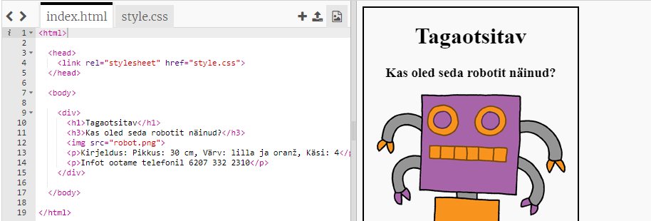
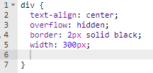
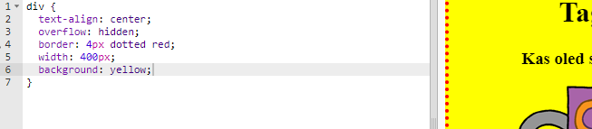

## Enda plakati kujundamine

Alustame plakati CSS-koodi redigeerimisest.

+ Ava see trinket: <a target="_blank" href="https://trinket.io/html/9add4041dd">https://trinket.io/html/9add4041dd</a>.
    
    Projekt peaks välja nägema selline:
    
    

+ Klõpsa vahekaardil "style.css". Märkad, et CSS-omadused `div` jaoks on juba seal olemas, sisaldades plakati eri osi.
    
        div {
            text-align: center;
            overflow: hidden;
            border: 2px solid black;
            width: 300px;
        }   
        

+ Alustame omaduse `text-align` muutmisest:
    
        text-align: center;
        
    
    Mis juhtub, kui muudad sõna `center` sõnaks `left` või `right`?

+ Kuidas on lood omadusega `border`?
    
        border: 2px solid black;
        
    
    Ülaltoodud koodis tähendab `2px` 2 pikslit. Mis juhtub siis, kui asendad `2px solid black` `4px dotted red`?

+ Muuda plakati `width` `400 piksliks`. Mis juhtub plakatiga?

+ Lisame natuke CSS-i, et panna paika plakati taustavärv. Mine oma koodi 5. rea lõppu ja vajuta naase, et sul tekiks uus tühi rida.
    
    
    
    Trüki oma uuele tühjale reale järgnev kood:
    
        background: yellow;
        
    
    Veendu, et kirjutasid koodi *täpselt* nagu ülalpool. Peaksid märkama, et `
` taust on nüüd kollane.
    
    