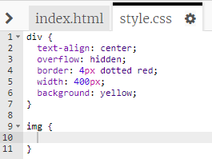
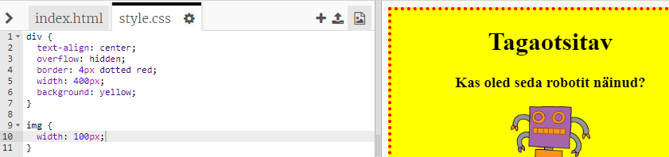

## Piltide kujundamine

Täiustame plakatil oleva pildi stiili.

+ Praegu ei ole sinu `&lt;img&gt;` sildi jaoks ühtegi CSS-omadust, nii et lisame mõned!
    
    Esmalt lisa oma div-i CSS-i alla järgmine kood:
    
        img {
        
        }
        
    
    

+ We can now add CSS properties for images between the curly brackets.
    
    Lisa näiteks see kood looksulgude vahel pildi laiuse määramiseks:
    
        width: 100px;
        
    
    Näed, et pildi suurus muutub, selle laius on nüüd 100 pikslit.
    
    

+ Selle koodiga saad lisada pildile ka äärise:
    
        border: 1px solid black;
        

+ Kas oled märganud, et pildi ja äärise vahel pole palju ruumi?
    
    
    
    Saad seda parandada, lisades pildi ümber natuke täidist:
    
        padding: 10px;
        
    
    Täidis on ruum sisu (antud juhul pilt) ja selle äärise vahel.
    
    
    
    Mis sinu meelest juhtub, kui muudad täidise suurust `50px-ni`?