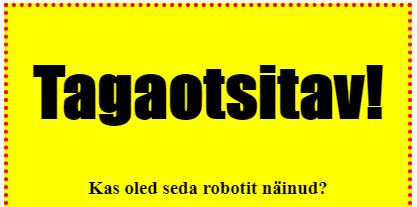
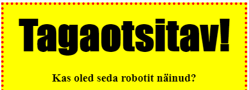

## Stiilirubad

Parandame rubriigi `<h1>` stiili.

+ Lisage oma pildi CSS-i alla järgmine kood:
    
        h1 {
        
        }
        
    
    Siin lisate oma peamise `<h1>` pealkirja CSS-i omadused.

+ Oma `<h1>` rubriigi fondi muutmiseks lisage lokkide sulgudes järgmine kood:
    
        font-family: mõju;
        

+ Saate muuta ka pealkirja suurust:
    
        font-size: 50pt;
        

+ Kas olete märganud, et rubriigi `<h1>` ja selle ümbruse vahel on suur ruum?
    
    
    
    Seda seetõttu, et pealkirja ümber on varu. Märgistus on elemendi (antud juhul rubriigi) ja selle ümbruses asuvate ruumide vaheline kaugus.
    
    Selle koodiga saab marginaali vähendada:
    
        marginaal: 10px;
        
    
    

+ Võite rõhutada ka pealkirja:
    
        tekstikujundus: rõhutage;