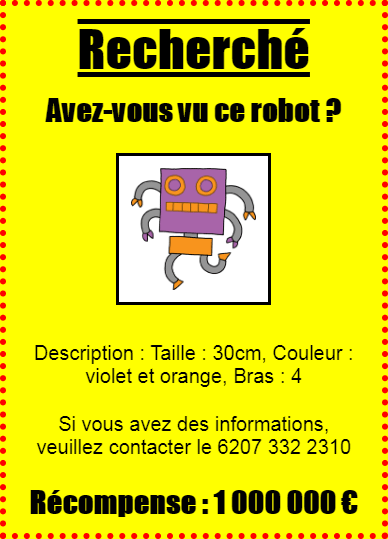

## Introduction

Dans ce projet, tu vas apprendre à créer ta propre affiche.

### Informations complémentaires pour les responsables de club

Si vous avez besoin d'imprimer ce projet, merci d'utiliser la [Version imprimable](https://projects.raspberrypi.org/en/projects/wanted/print).

## \--- collapse \---

## title: Notes pour le responsable de club

## Introduction :

Dans ce projet, les enfants auront l’occasion d’écrire leur propre code CSS. Ils pourront également éditer et écrire des propriétés CSS et des sélecteurs pour créer leur propre affiche.

## Ressources en ligne

Nous recommandons d'utiliser [trinket](https://trinket.io/) pour écrire du HTML & CSS en ligne. Ce projet contient les trinkets suivants :

* [Point de départ de « Recherché » -- jumpto.cc/web-wanted](http://jumpto.cc/web-wanted)

Les enfants peuvent également utiliser ce trinket vide [(jumpto.cc/html-blank)](http://jumpto.cc/html-blank) pour écrire leur propre code HTML & CSS, ou utiliser ce trinket modèle [(jumpto.cc/html-template)](http://jumpto.cc/html-template).

Il y a aussi un Trinket contenant un exemple de solution pour les défis :

* [« Recherché » terminé - trinket.io/html/ebeb56398a](https://trinket.io/html/ebeb56398a)

## Ressources hors-ligne

Ce projet peut être [terminé hors-ligne](https://rpf.io/html-offline) si désiré. Vous pouvez accéder aux ressources du projet en cliquant sur le lien « Matériel pour projet ». Ce lien contient une section « Ressources du projet » qui inclut les ressources dont les enfants auront besoin pour terminer le projet hors-ligne. Assurez-vous que les enfants ont accès à une copie de ces ressources. Cette section inclut les fichiers suivants :

* template/index.html
* template/style.css
* wanted/index.html
* wanted/style.css
* wanted/robot.png

Vous pouvez aussi trouver une version terminée du projet dans la section « Ressources du bénévole » qui contient :

* wanted-finished/index.html
* wanted-finished/style.css
* wanted-finished/robot.png

(Toutes les ressources ci-dessus peuvent aussi être téléchargées dans les fichiers `.zip` projet et bénévole)

## Objectifs d'apprentissage

* Ce projet donne aux enfants la possibilité d’écrire leur propre code CSS pour styler une page Web.

Ce projet couvre les éléments suivants du [Programme Raspberry Pi de Créativité Numérique](http://rpf.io/curriculum):

* [Concevoir des éléments de base en 2D et 3D](https://www.raspberrypi.org/curriculum/design/creator).

## Défis

* « Améliore ton affiche » - ajout de nouvelles propriétés CSS au sélecteur` div `;
* « Améliore ton image » - ajout de nouvelles propriétés CSS au sélecteur` div `;
* « Rend ton poster cool » - ajout de nouvelles propriétés CSS et de nouveaux sélecteurs;` h3 ` et ` p `;
* « Annonce un événement » - Écrire et éditer du code HTML et CSS.

\--- /collapse \---

## \--- collapse \---

## title: Matériel pour le projet

## Ressources pour le projet

* [Fichier .zip contenant toutes les ressources du projet](https://rpf.io/p/en/wanted-go)
* [Trinket en-ligne contenant les ressources du projet « Recherché »](http://jumpto.cc/web-wanted)
* [Modèle de trinket en ligne](http://jumpto.cc/trinket-template)
* [Trinket vierge](http://jumpto.cc/trinket-blank)
* [template/index.html](resources/template-index.html)
* [template/style.css](resources/template-style.css)
* [wanted/index.html](resources/wanted-index.html)
* [wanted/style.css](resources/wanted-style.css)
* [wanted/robot.png](resources/wanted-robot.png)

## Ressources pour le responsable de club

* [Fichier .zip contenant toutes les ressources du projet terminé](https://rpf.io/p/en/wanted-go)
* [Trinket Python en ligne vierge](https://trinket.io/html/ebeb56398a)
* [wanted-finished/index.html](resources/wanted-finished-index.html)
* [wanted-finished/style.css](resources/wanted-finished-style.css)
* [wanted-finished/robot.png](resources/twanted-finished-robot.png)

\--- /collapse \---