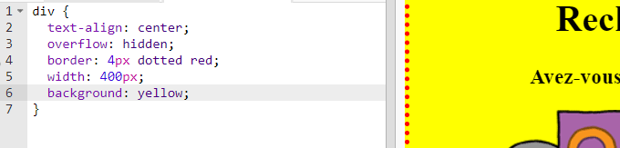

## Style ton poster

Commençons par éditer le code CSS pour ton poster.

+ Ouvre ce trinket: <a href="http://jumpto.cc/web-wanted" target="_blank">jumpto.cc/web-wanted</a>. Si tu es sur la version en ligne, tu peux aussi utiliser la version embarquée de Trinket:

<div class="trinket">
 <iframe src="https://trinket.io/embed/html/58318bee1f" width="100%" height="550" frameborder="0" marginwidth="0" marginheight="0" allowfullscreen>
 </iframe>
</div>

+ Clique sur l'onglet "style.css". Tu verras qu'il y a déjà une propriété CSS pour l'élément `div` qui contient les différentes parties de ton poster.

	```
	div {
		text-align: center;
	    overflow: hidden;
	    border: 2px solid black;
	    width: 300px;
    }
	```

+ Commençons par changer la proriété `text-align`:

	```
	text-align: center;
	```

	Que ce passe-t-il lorsque tu changes la valeur `center` en `left` ou `right`?

+ Et qu'en est-il de la propriété `border` ?

	```
	border: 2px solid black;
	```

	`2px` veux dire 2 pixels. Qu'est-ce qui se passe si tu changes `2px solid black` en `4px dotted red`?

+ Change la longueur `width` de ton poster a `400px`. Qu'est ce qui change sur ton poster?

+ Ajoutons un peu de CSS pour changer la couleur de fond. Va à la ligne 5 de ton code et appuie sur la touche 'Entrer', pour commencer une nouvelle ligne.

	

	Entre le code suivant sur ta nouvelle ligne:

	```
	background: yellow;
	```

	Fait attention a _correctement_ écrire le code ci-dessus. Tu devrais voir le fond de ton `<div>` changer en jaune.

	
