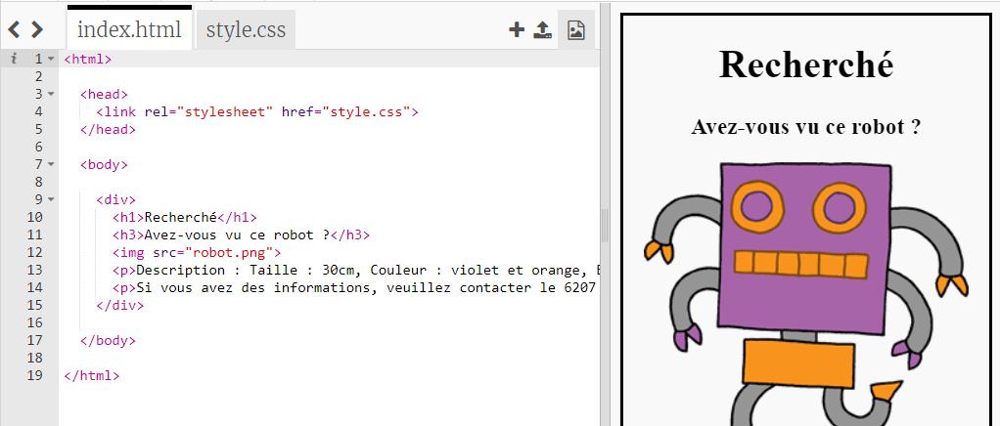

## Stylise ton affiche

Commençons par modifier le code CSS de l’affiche.

+ Ouvre ce trinket: <a target="_blank" href="https://trinket.io/html/8e3d85fcc2">trinket.io/html/8e3d85fcc2</a>.
    
    Le projet devrait ressembler à ceci :
    
    

+ Clique sur l'onglet « style.css ». Tu remarqueras qu'il existe déjà des propriétés CSS pour le `div` contenant les différentes parties de l'affiche.
    
        div {
            text-align: center;
            overflow: hidden;
            border: 2px solid black;
            width: 300px;
        }   
        

+ Commençons par modifier la propriété `text-align`:
    
        text-align: center;
        
    
    Que se passe-t-il lorsque tu remplace le mot `center` par `left ` ou `right` ?

+ Qu'en est-il de la propriété `border` ?
    
        border: 2px solid black;
        
    
    `2px` dans le code ci-dessus signifie 2 pixels. Que se passe-t-il lorsque tu changes `2px solid black` à `4px dotted red` ?

+ Change `width` de l'affiche à `400px` . Qu'advient-il de l'affiche ?

+ Ajoutons quelques CSS pour définir la couleur de fond de l'affiche. Va à la fin de la ligne 5 de ton code et appuie sur Entrée pour avoir une nouvelle ligne vierge.
    
    
    
    Entre le code suivant dans ta nouvelle ligne vide :
    
        background: yellow;
        
    
    Assure-toi d'entrer le code *exactement* comme ci-dessus. Tu devrais remarquer que l’arrière-plan du `
` est maintenant jaune.
    
    