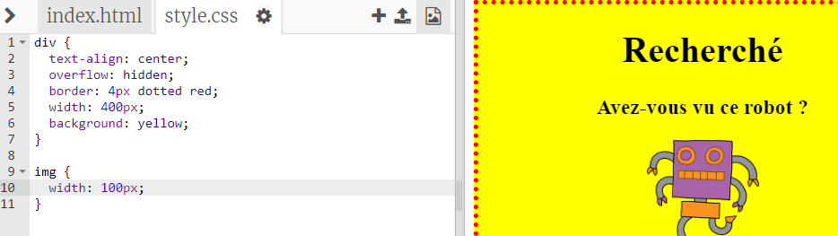

## Style d'image

Améliorons le style de l'image dans l'affiche.

+ Pour l'instant, il n'y a pas de propriétés CSS pour ta balise ``, ajoutons-en!
    
    Premièrement, ajoute le code suivant sous le CSS pour ton div:
    
        img {
        
        }
        
    
    

+ Nous pouvons maintenant ajouter des propriétés CSS pour les images entre les accolades.
    
    Par exemple, ajoute ce code entre les accolades pour définir la largeur de l'image:
    
        width: 100px;
        
    
    Tu verras que la taille de l'image change, de sorte que sa largeur est de 100 pixels.
    
    

+ Tu peux également ajouter une bordure autour de l'image avec ce code:
    
        bordure: noir 1px;
        

+ As-tu remarqué qu'il n'y a pas beaucoup d'espace entre l'image et la bordure?
    
    
    
    Tu peux résoudre ce problème en ajoutant des éléments de remplissage autour de l'image:
    
        padding: 10px;
        
    
    Le rembourrage est l'espace entre le contenu (dans le cas présent une image) et sa bordure.
    
    
    
    Que penses-tu qu'il se passerait si tu changeais le remplissage en ` 50px ` ?