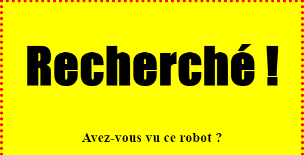
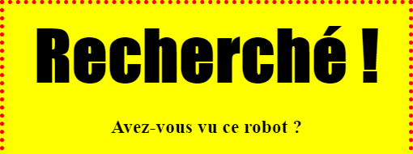

## Style ton titre

Et maintenant, améliorons le style de ton titre, le tag `<h1>`.

+ Ajoute le code suivant en dessus du code CSS pour ton image:

	```
	h1 {

	}
	```
	C'est ici que tu va placer tes propriétés CSS pour ton titre `<h1>`.

+ Pour changer la typographie de ton `<h1>`, ajoute le code suivant entre les crochets.

	```
	font-family: Impact;
	```

+ Tu peux aussi changer la taille de ton titre:

	```
	font-size: 50pt;
	```

+ As tu remarqué qu'il y a beaucoup d'espace en le titre `<h1>` et tout ce qu'il y a autour ?

	

	C'est parce qu'il y a une marge autour du titre. Une marge, c'est l'espace entre l'élément (dans ce cas le titre) et les autres éléments autour de lui.

	Tu peux rendre la marge plus petite avec ce code:

	```
	margin: 10px;
	```

	

+ Tu peux aussi souligner ton titre:

	```
	text-decoration: underline;
	```
