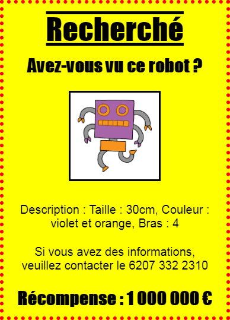

--- challenge ---
## Défi: Rend ton poster encore plus cool!
Ajoute plus de code CSS pour styler tes titres `<h3>` et tes paragraphes.



Voici une liste de propriétés CSS que tu peux utiliser:

```
color: black;
background: white;
font-family: Arial / Comic Sans MS / Courier / Impact / Tahoma;
font-size: 12pt;
font-weight: bold;
text-decoration: underline overline line-through;
margin: 10px;
padding: 10px;
width: 100px;
height: 100px;
```


--- /challenge ---