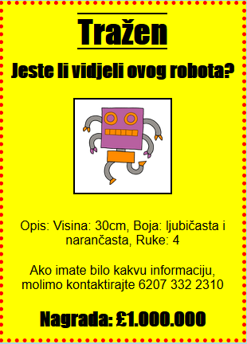

## Uvod

U ovom projektu naučit ćete kako napraviti svoj vlastiti plakat.

### Dodatne informacije za voditelje kluba

Ako želite ispisati ovaj projekt, molimo Vas da koristite [verziju koja je prilagođena za ispis](https://projects.raspberrypi.org/en/projects/wanted/print).

## \--- collapse \---

## naslov: Bilješke voditelja kluba

## Uvod:

U ovom projektu djeca će imati priliku napisati vlastiti CSS. Također će uređivati i pisati CSS svojstva i selektore kako bi napravili vlastiti poster.

## Online izvori

Preporučujemo korištenje [trinket](https://trinket.io/) pisati HTML & amp; CSS online. Ovaj projekt sadrži sljedeće stvari:

* ['Tražen' polazna točka - jumpto.cc/web-wanted](http://jumpto.cc/web-wanted)

Djeca također mogu koristiti ovu praznu trinket [(jumpto.cc/html-blank)](http://jumpto.cc/html-blank) napisati vlastiti HTML & CSS ili alternativno mogu upotrijebiti ovaj predložak trinket [(jumpto.cc/html-template)](http://jumpto.cc/html-template).

Također je uključen i trinket koji sadrži prijedlog rješenja izazova:

* ['Tražen' je dovršen - trinket.io/html/ebeb56398a](https://trinket.io/html/ebeb56398a)

## Offline izvori

Ako želite, ovaj projekt može bit [završen offline](https://www.codeclubprojects.org/en-GB/resources/webdev-working-offline/). Materijalima projekta možete pristupiti klikom na poveznicu 'Project Materials'. Poveznica sadrži odjeljak 'Project Resources' u kojem se nalaze materijali koji će djeci biti potrebni za izradu projekta offline. Pobrinite se da svako dijete ima pristup kopiji ovih materijala. U odjeljku se nalaze sljedeće datoteke:

* template/index.html
* template/style.css
* wanted/index.html
* wanted/style.css
* wanted/robot.png

Dovršenu verziju projekta challenges možete pronaći i u odjeljku 'Volunteer Resources' koji sadrži:

* wanted-finished/index.html
* wanted-finished/style.css
* wanted-finished/robot.png

(Svi spomenuti materijali nalaze se u materijalima projekta i materijalima za volontere, moguće je preuzeti kao `.zip` datoteke.)

## Ciljevi učenja

* Ovaj projekt daje djeci mogućnost da napišu vlastiti CSS kako bi oblikovali web stranicu.

Ovaj projekt pokriva elemente sljedećih dijelova kurikuluma [Raspberry Pi Digital Making Curriculum](http://rpf.io/curriculum):

* [Dizajnirajte osnovna 2D i 3D sredstva](https://www.raspberrypi.org/curriculum/design/creator).

## Izazovi

* "Poboljšajte svoj poster" - dodavanje novih svojstava CSS-u u `div` selektor;
* "Poboljšajte vaše slike" - dodavanje novih svojstava CSS-a u `img` selektor;
* "Napravite svoj poster boljim" - dodavanje novih CSS svojstava i novih `h3` i `str` selektora;
* "Oglašavanje događaja" - Pisanje i uređivanje HTML i CSS koda.

\--- /collapse \---

## \--- collapse \---

## naziv: Projektni materijali

## Resursi projekta

* [.zip datoteka koja sadrži sve materijale projekta](resources/wanted-project-resources.zip)
* [Online Trinket sadrži sve 'Tražen!' resursa projekta](http://jumpto.cc/web-wanted)
* [Online Trinket predložak](http://jumpto.cc/trinket-template)
* [Online prazan Trinket](http://jumpto.cc/trinket-blank)
* [template/index.html](resources/template-index.html)
* [template/style.css](resources/template-style.css)
* [wanted/index.html](resources/wanted-index.html)
* [wanted/style.css](resources/wanted-style.css)
* [wanted/robot.png](resources/wanted-robot.png)

## Resursi voditelja kluba

* [.zip datoteka koja sadrži sve dovršene resurse projekta](resources/wanted-volunteer-resources.zip)
* [Dovršeni Online Trinket projekt](https://trinket.io/html/ebeb56398a)
* [wanted-finished/index.html](resources/wanted-finished-index.html)
* [wanted-finished/style.css](resources/wanted-finished-style.css)
* [twanted-finished/robot.png](resources/twanted-finished-robot.png)

\--- /collapse \---