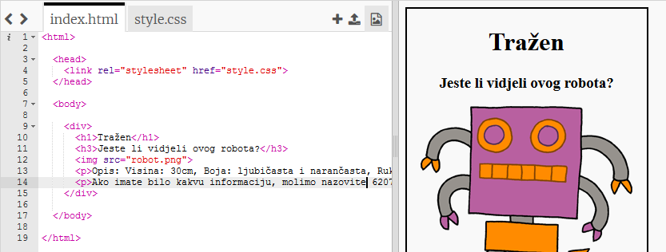
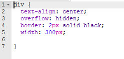
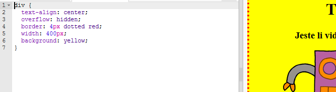

## Oblikovanje postera

Započnimo s uređivanjem CSS koda za poster.

+ Otvori ovaj trinket: <a target="_blank" href="http://jumpto.cc/web-wanted">jumpto.cc/web-wanted</a>.
    
    Projekt bi trebao izgledati ovako:
    
    

+ Kliknite na karticu "style.css". Primijetit ćete da već postoje CSS svojstva za `div` koji sadrži različite dijelove postera.
    
        div {
            text-align: center;
            overflow: hidden;
            border: 2px solid black;
            width: 300px;
        }   
        

+ Započnimo s mijenjanjem `text-align` svojstva:
    
        text-align: center;
        
    
    Što se događa kada promijenite riječ `center` u `left` ili `right`?

+ Što je s `border` svojstvima?
    
        border: 2px solid black;
        
    
    `2px` u gornjem kodu znači 2 piksela. Što se događa kada promijenite `2px solid black` u `4px dotted red`?

+ Promijenite `width` postera u `400px`. Što se dogodilo sa plakatom?

+ Dodajmo neki CSS da bismo postavili boju pozadine postera. Idite na kraj retka 5 svog koda i pritisnite return, tako da imate novi prazan redak.
    
    
    
    Upišite sljedeći kod na novi prazni redak:
    
        background: yellow;
        
    
    Provjerite jeste li točno napisali kod *exactly* kao što je gore. Trebate primijetiti da je pozadina `
` sada žuta.
    
    