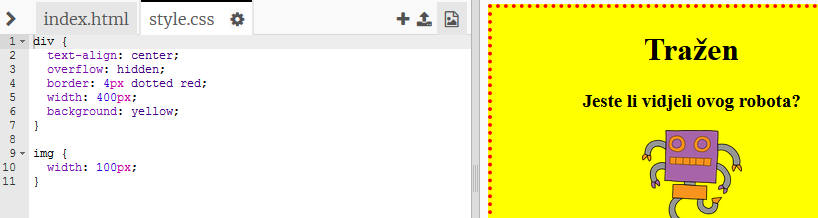

## Uređivanje slike

Poboljšajmo stil slike u plakatu.

+ Trenutačno nema CSS svojstava za vašu oznaku ``, pa dodajte nešto!
    
    Prvo dodajte sljedeći kod ispod CSS-a za vaš div:
    
        img {
        
        }
        
    
    

+ Sada možemo dodati CSS svojstva za slike unutar vitičastih zagrada.
    
    Na primjer, između vitičastih zagrada dodaj sljedeći kod. Njime određuješ širinu slike:
    
        width: 100px;
        
    
    Vidjet ćeš da se veličina slike promijenila. Sada je njezina širina 100 pixela.
    
    

+ Ovom slikom možete dodati i obrub oko slike:
    
        border: 1px solid black;
        

+ Primjećuješ li da nema puno mjesta između slike i obruba?
    
    
    
    Ovo možemo popraviti svojstvom ‘padding’:
    
        padding: 10px;
        
    
    Padding je prostor između sadržaja (u ovom slučaju slike) i njegovog obruba.
    
    
    
    Što misliš da će se dogoditi ako promjeniš padding na `50px`?