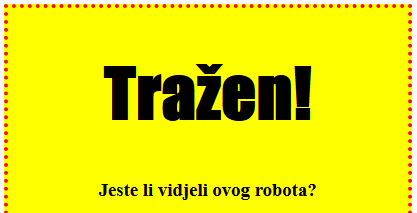
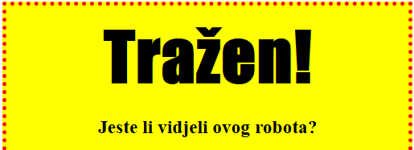

## Naslovi za oblikovanje

Poboljšamo stil zaglavlja `<h1>`.

+ Dodajte sljedeći kod ispod CSS-a svoje slike:
    
        h1 {
        
        }
        
    
    Ovdje ćete dodati svojstva CSS-a za svoj glavni `<h1>` naslov.

+ Da biste promijenili font za `<h1>` naslove, dodajte sljedeći kod između vitičastih zagrada:
    
        font-family: Impact;
        

+ Također možete promijeniti veličinu naslova:
    
        font-size: 50pt;
        

+ Jeste li primijetili da postoji veliki prostor između naslova `<h1>` i stvari oko njega?
    
    
    
    To je zato što postoji margina oko naslova. Margina je prostor između elementa (u ovom slučaju naslova) i ostalih stvari oko njega.
    
    S tim kodom možete smanjiti marginu:
    
        margin: 10px;
        
    
    

+ Možete i naglasiti svoj naslov:
    
        text-decoration: underline;