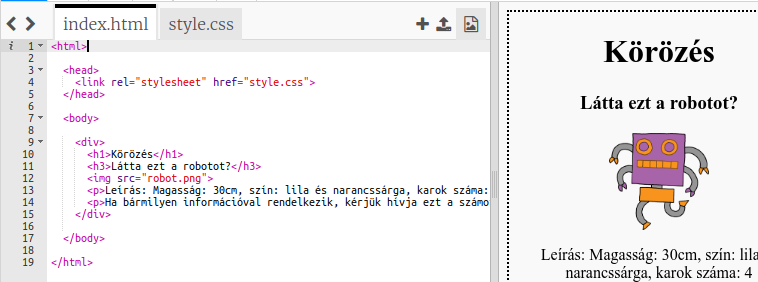
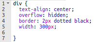
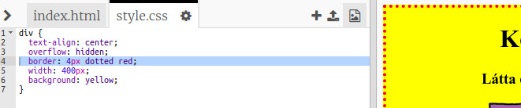

## A poszter stílusa

Kezdjük a poszter CSS-kódjának szerkesztésével.

+ Nyissa meg ezt az csecsebecsét: <a target="_blank" href="http://jumpto.cc/web-wanted">jumpto.cc/web-wanted</a>.
    
    A projektnek így kell kinéznie:
    
    

+ Kattintson a "style.css" fülre. Észre fogja venni, hogy a `div` már vannak CSS tulajdonságok, amelyek a poszter különböző részeit tartalmazzák.
    
        div {
            szöveg-igazítás: központ;
            túlcsordulás: rejtett;
            szegély: 
         képpont szilárd fekete;
            szélesség: 300 képpont;
        }   
        

+ Kezdjük a `szöveg-igazítás` tulajdonság megváltoztatásával:
    
        szöveg igazítás: középpont;
        
    
    Mi történik, ha megváltoztatja a szót `center` , hogy `balra` vagy `jobbra`?

+ Mi a helyzet a `határ` ingatlan?
    
        szegély: 2 képpont szilárd fekete;
        
    
    `2px` a fenti kódban 2 pixelt jelent. Mi történik, ha `2x-os szilárd feketét` ról `re <code> pontos pirosra cserél`?

+ Változás a `szélessége` a poszter `400px`. Mi történik a poszterrel?

+ Adjunk hozzá néhány CSS-t a poszter háttér színének beállításához. Menjen a kód 5. sorának végére és nyomja meg a visszatérést, hogy új üres sor legyen.
    
    
    
    Írja be a következő kódot az új üres sorba:
    
        háttér: sárga;
        
    
    Győződjön meg róla, hogy írja be a kódot *pontosan* , mivel a fenti. Ne feledje, hogy a `
` háttere most sárgán világít.
    
    