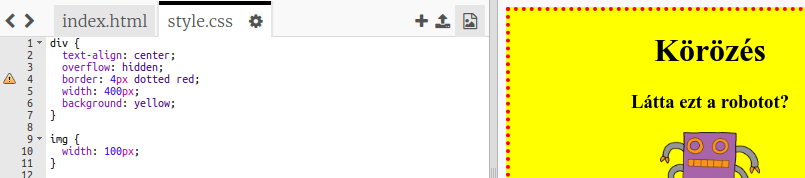

## Stílusos képek

Javítsuk a kép stílusát a poszterben.

+ Jelenleg nincs `` tulajdonság a `  ` címkéhez, szóval adjunk hozzá néhányat!
    
    Először adja hozzá a következő kódot a divs CSS alá:
    
        img {
        
        }
        
    
    

+ Most hozzáadhatunk CSS tulajdonságokat a képekhez a göndör zárójelben.
    
    Például adja hozzá ezt a kódot a göndör zárójelek közé a kép szélességének beállításához:
    
        szélesség: 100 képpont;
        
    
    Látni fogja, hogy a kép mérete megváltozik, így szélessége 100 pixel.
    
    

+ A kép körül szegélyt is felvehet a következő kóddal:
    
        szegély: 1 képpont szilárd fekete;
        

+ Észrevetted, hogy nincs sok hely a kép és a keret között?
    
    
    
    Javíthatja ezt a kép körül néhány párnázattal:
    
        párnázat: 10 képpont;
        
    
    A padding az a tartalom (ebben az esetben egy kép) és a szegély közötti tér.
    
    
    
    Ön szerint mi történne, ha a párnát `50px`?