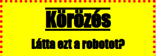

## Stílus fejlécek

Javítsuk a `<h1>` címsor stílusát.

+ Adja hozzá a következő kódot a kép CSS alá:
    
        h1 {
        
        }
        
    
    Itt ad hozzá CSS tulajdonságokat a fő `<h1>` címsorhoz.

+ A `<h1>` címsor betűtípusának megváltoztatásához adja hozzá a következő kódot a göndör zárójelbe:
    
        font-család: Impact;
        

+ A címsor méretét is megváltoztathatja:
    
        betűméret: 50pt;
        

+ Észrevetted, hogy nagy hely van a `<h1>` címsor és a körülötte lévő dolgok között?
    
    
    
    Ennek oka az, hogy van egy mozgástér a címsor körül. A margó az elem (ebben az esetben egy fejléc) és a körülötte lévő többi elem közötti hely.
    
    A margóval kisebb lehet a következő kód:
    
        margin: 10 képpont;
        
    
    

+ Hangsúlyozhatja a fejlécét is:
    
        szöveges dekoráció: aláhúzás;