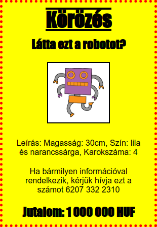

\--- kihívás \---

## Kihívás: tedd félelmetesvé a posztert!

Adjon hozzá további CSS-kódot a `<h3>` címsor és a bekezdések stílusához.

Itt található néhány felhasználható CSS-tulajdonság:

    fekete szín;
    háttér: fehér;
    betűkészlet-család: Arial / Comic Sans MS / Courier / Impact / Tahoma;
    betűméret: 12pt;
    betűsúly: félkövér;
    szövegdíszítés: aláhúzás az aláhúzás vonallal;
    margó: 10 képpont;
    párnázat: 10 képpont;
    szélesség: 100 képpont;
    magasság: 100 képpont;
    

\--- / challenge \---