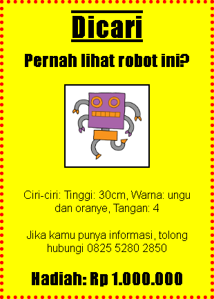

## Pengantar

Dalam proyek ini, Anda akan belajar cara membuat poster sendiri.

### Informasi tambahan untuk pemimpin klub

Jika Anda perlu mencetak proyek ini, silakan gunakan [Printer friendly version](https://projects.raspberrypi.org/en/projects/wanted/print).

## \--- jatuh \---

## judul: Catatan pemimpin klub

## Pengantar:

Dalam proyek ini, anak-anak akan memiliki kesempatan untuk menulis CSS mereka sendiri. Mereka juga akan mengedit dan menulis properti dan selektor CSS untuk membuat poster mereka sendiri.

## Sumber Daya Online

Kami merekomendasikan menggunakan [trinket](https://trinket.io/) untuk menulis HTML & CSS secara online. Proyek ini berisi pernak-pernik berikut:

* [Titik awal 'Dicari' - jumpto.cc/web-wanted](http://jumpto.cc/web-wanted)

Anak-anak juga dapat menggunakan perhiasan kosong ini [(jumpto.cc/html-blank)](http://jumpto.cc/html-blank) untuk menulis HTML & CSS mereka sendiri, atau secara alternatif mereka dapat menggunakan trinket template [(jumpto.cc/html-template)](http://jumpto.cc/html-template).

Ada juga trinket yang berisi solusi sampel untuk tantangan:

* ['Dicari' Selesai - trinket.io/html/ebeb56398a](https://trinket.io/html/ebeb56398a)

## Sumber Daya Offline

Proyek ini dapat [selesai offline](https://www.codeclubprojects.org/en-GB/resources/webdev-working-offline/) jika disukai. Anda dapat mengakses sumber daya proyek dengan mengklik tautan 'Project Materials' untuk proyek ini. Tautan ini berisi bagian 'Sumber Proyek', yang mencakup sumber daya yang dibutuhkan anak-anak untuk menyelesaikan proyek ini secara offline. Pastikan bahwa setiap anak memiliki akses ke salinan sumber daya ini. Bagian ini termasuk file-file berikut:

* template / index.html
* template / style.css
* ingin / index.html
* ingin / style.css
* ingin / robot.png

Anda juga dapat menemukan versi lengkap dari tantangan proyek ini di bagian 'Sumber Relawan', yang berisi:

* ingin jadi / index.html
* diinginkan-jadi / style.css
* ingin jadi / robot.png

(Semua sumber daya di atas juga dapat diunduh sebagai proyek dan relawan `file .zip`).

## Tujuan Pembelajaran

* Proyek ini memberi anak-anak kesempatan untuk menulis CSS mereka sendiri untuk menata halaman web.

Proyek ini mencakup elemen dari untaian berikut dari [Raspberry Pi Digital Making Curriculum](http://rpf.io/curriculum):

* [Desain aset 2D dan 3D dasar](https://www.raspberrypi.org/curriculum/design/creator).

## Tantangan

* "Memperbaiki poster Anda" - menambahkan properti CSS baru ke pemilih `div`;
* "Meningkatkan citra Anda" - menambahkan properti CSS baru ke pemilih `img`;
* "Buat poster Anda luar biasa" - tambahkan properti CSS baru dan pemilih `h3` dan `p`;
* "Advertise an event" - Menulis dan mengedit kode HTML dan CSS.

\--- /jatuh \---

## \--- jatuh \---

## judul: Materi proyek

## Sumber daya proyek

* [file .zip yang berisi semua sumber daya proyek](resources/wanted-project-resources.zip)
* [Trinket Online mengandung semua 'Dicari!' sumber daya proyek](http://jumpto.cc/web-wanted)
* [Template Trinket Online](http://jumpto.cc/trinket-template)
* [Trinket kosong daring](http://jumpto.cc/trinket-blank)
* [template / index.html](resources/template-index.html)
* [template / style.css](resources/template-style.css)
* [ingin / index.html](resources/wanted-index.html)
* [ingin / style.css](resources/wanted-style.css)
* [ingin / robot.png](resources/wanted-robot.png)

## Sumber daya pemimpin klub

* [file .zip yang berisi semua sumber daya proyek yang telah selesai](resources/wanted-volunteer-resources.zip)
* [Proyek Trinket yang diselesaikan secara daring](https://trinket.io/html/ebeb56398a)
* [ingin jadi / index.html](resources/wanted-finished-index.html)
* [diinginkan-jadi / style.css](resources/wanted-finished-style.css)
* [twanted-finished / robot.png](resources/twanted-finished-robot.png)

\--- /jatuh \---