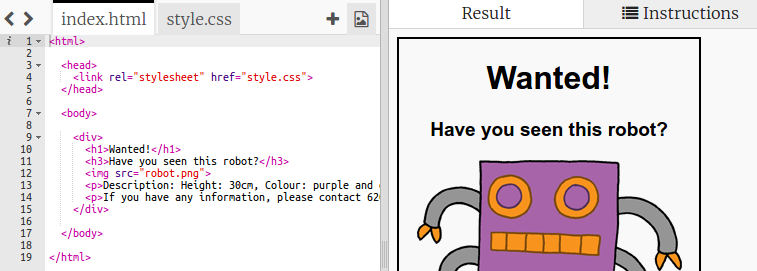

## Pasang poster Anda

Mari kita mulai dengan mengedit kode CSS untuk poster.

+ Buka trinket ini: <a target="_blank" href="http://jumpto.cc/web-wanted">jumpto.cc/web-wanted</a>.
    
    Proyek akan terlihat seperti ini:
    
    

+ Klik pada tab "style.css". Anda akan melihat bahwa sudah ada properti CSS untuk `div` berisi bagian-bagian berbeda dari poster.
    
        div {
            text-align: center;
            overflow: tersembunyi;
            border: 2px berwarna hitam pekat;
            lebar: 300px;
        }   
        

+ Mari kita mulai dengan mengubah properti `text-align`:
    
        text-align: center;
        
    
    Apa yang terjadi ketika Anda mengubah kata `tengah` menjadi `kiri` atau `kanan`?

+ Bagaimana dengan properti `perbatasan`?
    
        border: 2px berwarna hitam pekat;
        
    
    `2px` dalam kode di atas berarti 2 piksel. Apa yang terjadi ketika Anda mengubah `2px hitam solid` menjadi `4px dengan titik merah`?

+ Ubah lebar `` dari poster menjadi `400px`. Apa yang terjadi pada poster itu?

+ Mari tambahkan beberapa CSS untuk mengatur warna latar belakang poster. Pergi ke ujung baris 5 kode Anda dan tekan kembali, sehingga Anda memiliki garis kosong baru.
    
    
    
    Ketik kode berikut pada baris kosong baru Anda:
    
        latar belakang: kuning;
        
    
    Pastikan Anda mengetikkan kode *tepat* seperti di atas. Anda harus memperhatikan bahwa latar belakang `
` sekarang berwarna kuning.
    
    