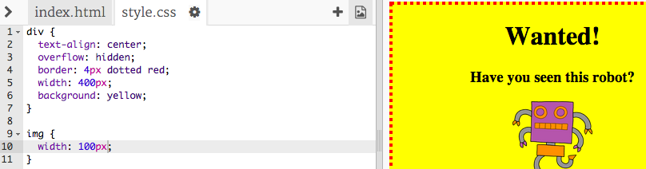

## Gambar Styling

Mari tingkatkan gaya gambar di poster.

+ Saat ini, tidak ada properti CSS untuk tag `` , jadi mari tambahkan beberapa!
    
    Pertama, tambahkan kode berikut di bawah CSS untuk div Anda:
    
        img {
        
        }
        
    
    

+ Kami sekarang dapat menambahkan properti CSS untuk gambar antara kurung kurawal.
    
    Misalnya, tambahkan kode ini di antara kurung kurawal untuk mengatur lebar gambar:
    
        lebar: 100px;
        
    
    Anda akan melihat bahwa ukuran gambar berubah, sehingga lebarnya 100 piksel.
    
    

+ Anda juga dapat menambahkan perbatasan di sekitar gambar dengan kode ini:
    
        border: 1px berwarna hitam pekat;
        

+ Pernahkah Anda memperhatikan bahwa tidak ada banyak ruang antara gambar dan perbatasan?
    
    
    
    Anda dapat memperbaikinya dengan menambahkan beberapa padding di sekitar gambar:
    
        padding: 10px;
        
    
    Padding adalah ruang antara konten (dalam hal ini gambar) dan perbatasannya.
    
    
    
    Menurut Anda apa yang akan terjadi jika Anda mengubah padding menjadi `50px`?