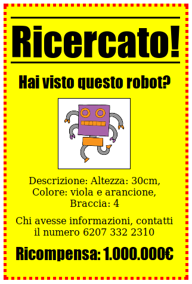

## Introduzione

In questo progetto imparerai a creare il tuo poster.

### Ulteriori informazioni per gli organizzatori dei club

Se intendete stampare questo progetto, cliccate su [Versione stampabile](https://projects.raspberrypi.org/en/projects/wanted/print).

## \--- collapse \---

## title: Note per i volontari

## Introduzione:

In questo progetto i ragazzi potranno scrivere il proprio CSS. Potranno anche modificare e scrivere proprietà e selettori CSS per creare il proprio poster.

## Risorse online

Consigliamo di usare un [trinket](https://trinket.io/) per scrivere in HTML e CSS online. Questo progetto contiene i seguenti trinket:

* [Punto di partenza 'Wanted' -- jumpto.cc/web-wanted](http://jumpto.cc/web-wanted)

I ragazzi possono anche usare questo trinket vuoto [(jumpto.cc/html-blank)](http://jumpto.cc/html-blank) per scrivere liberamente in HTML e CSS, oppure possono usare questo modello [(jumpto.cc/html-template)](http://jumpto.cc/html-template).

È disponibile anche un trinket con esempi di soluzioni alle sfide:

* ['Wanted' completato -- trinket.io/html/ebeb56398a](https://trinket.io/html/ebeb56398a)

## Risorse offline

Se preferite, questo progetto può anche essere [completato offline](https://www.codeclubprojects.org/en-GB/resources/webdev-working-offline/). È possibile accedere alle risorse del progetto facendo click sul link "Materiali del progetto" relativo a questo progetto. Questo link contiene una sezione "Risorse del progetto", con le risorse necessarie ai ragazzi per completare il progetto offline. Assicuratevi che ogni ragazzo abbia accesso a una copia di queste risorse. Questa sezione include i seguenti file:

* template/index.html
* template/style.css
* wanted/index.html
* wanted/style.css
* wanted/robot.png

Potete trovare una possibile soluzione delle sfide di questo progetto nella sezione 'Risorse per i volontari', che contiene:

* wanted-finished/index.html
* wanted-finished/style.css
* wanted-finished/robot.png

(Tutte le risorse sopracitate, per progetto e volontari, sono anche scaricabili come file `.zip `.)

## Obiettivi di apprendimento

* Questo progetto permette ai ragazzi di scrivere un CSS per modificare l'aspetto di una pagina web.

Questo progetto riguarda elementi trattati in queste sezioni del [Digital Making Curriculum di Raspberry Pi](http://rpf.io/curriculum):

* [Risorse base di progettazione 2D e 3D](https://www.raspberrypi.org/curriculum/design/creator).

## Sfide

* "Migliora il tuo poster" - aggiungendo nuove proprietà CSS al selettore `div`;
* "Migliora la tua immagine" - aggiungendo nuove proprietà CSS al selettore `img`;
* "Rendi il tuo poster straordinario" - aggiungendo nuove proprietà CSS e nuovi selettori `h3` e `p`;
* "Pubblicizza un evento" - Scrivi e modifica il codice HTML e CSS.

\--- /collapse \---

## \--- collapse \---

## title: Materiali del progetto

## Risorse del progetto

* [.zip file con tutte le risorse del progetto](resources/wanted-project-resources.zip)
* [Trinket online contenente tutte le risorse del progetto 'Wanted!'](http://jumpto.cc/web-wanted)
* [Modello Trinket online](http://jumpto.cc/trinket-template)
* [Trinket online vuoto](http://jumpto.cc/trinket-blank)
* [template/index.html](resources/template-index.html)
* [template/style.css](resources/template-style.css)
* [wanted/index.html](resources/wanted-index.html)
* [wanted/style.css](resources/wanted-style.css)
* [wanted/robot.png](resources/wanted-robot.png)

## Risorse per gli organizzatori del club

* [File .zip con tutte le risorse del progetto completate](resources/wanted-volunteer-resources.zip)
* [Trinket online completato](https://trinket.io/html/ebeb56398a)
* [wanted-finished/index.html](resources/wanted-finished-index.html)
* [wanted-finished/style.css](resources/wanted-finished-style.css)
* [wanted-finished/robot.png](resources/twanted-finished-robot.png)

\--- /collapse \---