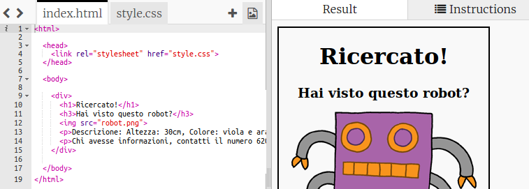
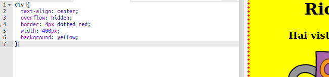

## Styling your poster

Iniziamo modificando il codice CSS del poster.

+ Apri questo trinket: <a target="_blank" href="http://jumpto.cc/web-wanted">jumpto.cc/web-wanted</a>.
    
    Il progetto dovrebbe assomigliare a questo:
    
    

+ Fai clic sulla scheda "style.css". Noterai che esistono già delle proprietà CSS per il `div` che contiene le diverse parti del poster.
    
        div {
            text-align: center;
            overflow: hidden;
            border: 2px solid black;
            width: 300px;
        }   
        

+ Iniziamo modificando la proprietà `text-align`:
    
        text-align: center;
        
    
    Che succede quando cambi la parola `center` in `left` o `right`?

+ How about the `border` property?
    
        border: 2px solid black;
        
    
    `2px` nel codice qui sopra significa 2 pixel. Cosa succede cambiando `2px solid black` in `4px dotted red`?

+ Porta la `width` del poster a `400px`. Cosa succede al poster?

+ Let's add some CSS to set the background colour of the poster. Go to the end of line 5 of your code and press return, so that you have a new blank line.
    
    
    
    Type the following code on your new blank line:
    
        background: yellow;
        
    
    Make sure that you type in the code *exactly* as it is above. You should notice that the background of the `
` is now yellow.
    
    