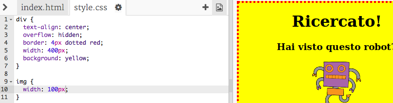

## Modificare l'aspetto delle immagini

Miglioriamo l'aspetto dell'immagine nel poster.

+ Al momento, non ci sono proprietà CSS per il tuo tag ``, aggiungiamone un po'!
    
    Per prima cosa, aggiungi questo codice sotto il CSS relativo al tuo div:
    
        img {
        
        }
        
    
    

+ Ora possiamo aggiungere delle proprietà CSS per le immagini tra le parentesi graffe.
    
    Ad esempio, aggiungi questo codice tra le graffe per impostare la larghezza dell'immagine:
    
        width: 100px;
        
    
    Vedrai che la dimensione dell'immagine cambierà, e la sua larghezza diventerà 100 pixel.
    
    

+ Puoi anche aggiungere un bordo attorno all'immagine con questo codice:
    
        border: 1px solid black;
        

+ Hai notato che non c'è molto spazio tra l'immagine e il bordo?
    
    
    
    Puoi ovviare al problema aggiungendo un po' di padding attorno all'immagine:
    
        padding: 10px;
        
    
    La proprietà padding indica lo spazio tra il contenuto (in questo caso un'immagine) e il suo bordo.
    
    
    
    Cosa pensi che sarebbe successo se avessi cambiato il padding a `50px`?