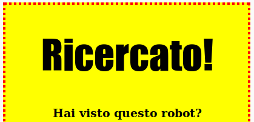

## Personalizzare le intestazioni

Miglioriamo lo stile dell'intestazione `<h1>`.

+ Aggiungi questo codice sotto la regola CSS dell'immagine:
    
        h1 { 
        
        }
        
    
    Qui dentro aggiungeremo le proprietà CSS per l'intestazione `<h1>`.

+ Aggiungi il codice qui sotto per cambiare il font dell'intestazione `<h1>`:
    
        font-family: Impact;
        

+ Puoi anche cambiare la dimensione l'intestazione:
    
        font-size: 50pt;
        

+ Hai notato che c'è molto spazio tra l'intestazione `<h1>` e quello che le sta intorno?
    
    
    
    Questo succede perché c'è un margine tutto attorno. Un margine è lo spazio tra un elemento (in questo caso un'intestazione) e quelli che lo circondano.
    
    Puoi ridurre il margine con questo codice:
    
        margin: 10px;
        
    
    

+ Puoi anche sottolineare la tua intestazione:
    
        text-decoration: underline;