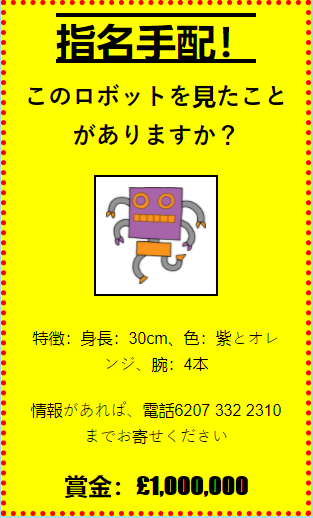

## はじめに

このプロジェクトでは、独自のポスターの作成方法を学びます。

### クラブリーダーのための追加情報

このプロジェクトを印刷する必要がある場合は、 印刷用バージョンを使用してください。

## \--- 折りたたむ \---

## タイトル : クラブリーダーメモ

## はじめに

このプロジェクトでは、子どもたちが自分のCSSを書く機会があります。また、CSSプロパティとセレクターを編集および作成して、独自のポスターを作成します。

## オンライン・リソース

オンラインでHTMLやCSSを書くため「trinket」を使うことをおすすめします。このプロジェクトでは次のtrinketが含まれています。

* [「指名手配」出発点 - jumpto.cc/web-wanted](http://jumpto.cc/web-wanted)

子供たちはこの空白の「trinket」（jumpto.cc/html-blank） を使って独自のHTML & CSSを書くことができます。あるいは、trinket にあるテンプレート（jumpto.cc/html-template）を使用することもできます。

また、チャレンジ(課題)に対しての回答例を含むtrinketもあります(以下参照)。

* [「指名手配」完了 - trinket.io/html/ebeb56398a](https://trinket.io/html/ebeb56398a)

## オフライン・リソース

This project can be [completed offline](https://rpf.io/html-offline) if preferred. “プロジェクト資料”のリンクをクリックすることでこのプロジェクトのリソースにアクセスすることが可能です。 リンクには”プロジェクト・リソース”の個所もあり、ここにプロジェクトをオフラインで完成させるために必要なリソースが含まれている。 各子供がこれらのリソースのコピーにアクセスできることを確認してください。 このセクションは下記ファイルを含む：

* template/index.html
* template/style.css
* wanted/index.html
* wanted/style.css
* wanted/robot.png

You can also find a completed version of this project's challenges in the 'Club leader resources' section, which contains:

* wanted-finished/index.html
* wanted-finished/style.css
* wanted-finished/robot.png

上記のリソースはすべて、プロジェクトおよびボランティアの.zipファイルとしてダウンロードすることもできます

## 学習目標

* このプロジェクトは、子どもたちにウェブページのスタイルを設定する独自のCSSを書くチャンスを与えます。

このプロジェクトは、Raspberry Pi Digital Making Curriculumの以下の要素をカバーしています：

* 基本的な2Dおよび3Dアセットの設計 。

## チャレンジ

* 「ポスターの改善」-セレクタに新しいCSSプロパティを追加する。
* 「画像の改善」-セレクタに新しいCSSプロパティを追加する。
* 「ポスターをすばらしいものにする」-CSSコードを追加して、
    ### 見出しと
    
    段落のスタイルを設定します。</li> 
    
    * "イベントを宣伝しましょう" - HTMLとCSSコードの作成と編集。</ul> 
    
    \--- /折りたたむ \---
    
    ## \--- 折りたたむ \---
    
    ## タイトル: プロジェクト資料
    
    ## プロジェクト資料
    
    * [すべてのプロジェクトリソースを含む.zipファイル](https://rpf.io/p/en/wanted-go)
    * [すべての「指名手配！」を含むオンラインtrinketプロジェクトリソース](http://jumpto.cc/web-wanted)
    * [Online Trinketテンプレート](http://jumpto.cc/trinket-template)
    * [オンライン空のtrinket](http://jumpto.cc/trinket-blank)
    * [template/index.html](resources/template-index.html)
    * [template/style.css](resources/template-style.css)
    * [wanted/index.html](resources/wanted-index.html)
    * [wanted/style.css](resources/wanted-style.css)
    * [wanted/robot.png](resources/wanted-robot.png)
    
    ## クラブ・リーダー向けリソース
    
    * [完了したすべてのプロジェクトリソースを含む.zipファイル](https://rpf.io/p/en/wanted-go)
    * [完成版プロジェクトのオンラインtrinket](https://trinket.io/html/ebeb56398a)
    * [wanted-finished/index.html](resources/wanted-finished-index.html)
    * [wanted-finished/style.css](resources/wanted-finished-style.css)
    * [twanted-finished/robot.png](resources/twanted-finished-robot.png)
    
    \--- /折りたたむ \---